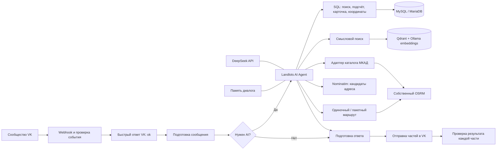

# Landlots — поиск земельных участков через VK

Landlots — AI-помощник для поиска земельных лотов в Московской области. Пользователь общается с сообществом VK, уточняет условия обычным языком, получает подборки, точные SQL-подсчёты, карточки участков и автомобильные маршруты.

Репозиторий содержит **рабочие конфигурации n8n без тестовых workflow**: пять опубликованных схем и одну служебную схему первоначальной индексации RAG. Снимок подготовлен 06.09.2026; точные версии и контрольные суммы находятся в [manifest.json](workflows/manifest.json). Включено исправление `Max iterations`: маршруты для списка участков рассчитываются пакетным инструментом.

> Это экспорт конфигурации, а не готовая копия серверов. Пароли, API-токены, базы данных, история переписки, дорожные карты и тестовые схемы не включены. Перед запуском нужно настроить credentials, реквизиты сообщества и доступ к внутренним сервисам. Существующие настройки работающего проекта при подготовке экспорта не изменялись.

## Содержание

- [Итоговая пояснительная записка с рисунками](docs/Итоговая_пояснительная_записка.md)
- [Возможности и границы](#возможности-и-границы)
- [Состав репозитория](#состав-репозитория)
- [Архитектура](#архитектура)
- [Основной workflow и все его ноды](#1-основной-workflow-vk-rag-bot)
- [Одиночный маршрут](#2-одиночный-маршрут-driving-route)
- [Ближайший въезд на МКАД](#3-ближайший-въезд-на-мкад-nearest-mkad-route)
- [Геокодирование адреса](#4-геокодирование-geocode-address)
- [Пакетные маршруты](#5-пакетные-маршруты-batch-driving-routes)
- [Первоначальная индексация](#6-первоначальная-индексация-initial-rag-index)
- [Данные и контракты инструментов](#данные-и-контракты-инструментов)
- [Развёртывание](#развёртывание)
- [Безопасность, обслуживание и ограничения](#безопасность-обслуживание-и-ограничения)

## Возможности и границы

- Поиск по округу/району, продаже или аренде, коду разрешённого использования, цене, площади и признаку открытого приёма заявок.
- Точный подсчёт лотов и уникальных кадастровых номеров по SQL-фильтрам.
- Смысловой поиск по документам Qdrant для условий, не представленных структурированными фильтрами.
- Уточнение предыдущего запроса с сохранением контекста диалога.
- Полная карточка лота: характеристики, сведения торгов и НСПД, дополнительные условия, даты обновления, ссылки на НСПД, OpenStreetMap и torgi.gov.ru из базы.
- Расстояние по автомобильным дорогам и приблизительное время без пробок между известными точками.
- Поиск адреса собственным Nominatim с подтверждением конечной точки пользователем.
- Поиск ближайшего из проверенных направленных въездов каталога МКАД.
- Сравнение маршрутов от 1–50 участков до одной конечной точки одним вызовом инструмента.

SQL-инструменты ограничены **Московской областью, код региона 50**. Карта маршрутизации и геокодирования включает Москву, область и приграничный буфер. Поэтому маршрут до Москвы поддерживается, но это не означает наличие московских земельных лотов в SQL-выдаче.

Бот работает с сохранёнными данными. Он не подтверждает текущую юридическую чистоту участка, наличие всех коммуникаций или актуальность торгов на внешней площадке. Карточка не заменяет выписку ЕГРН, а координаты центра участка не являются проверенным автомобильным въездом.

## Состав репозитория

```text
ReadME.MD
workflows/
  01-vk-landlots-bot.json
  02-driving-route.json
  03-nearest-mkad-route.json
  04-geocode-address.json
  05-batch-driving-routes.json
  06-initial-rag-index.json
  all-workflows.json
  manifest.json
docs/
  agent-system-prompt.md
  agent-system-prompt-v1.md
  agent-system-prompt-v2.md
  Итоговая_пояснительная_записка.md
  images/                         # рисунки пояснительной записки
scripts/
  package-workflows.mjs
  validate-workflows.mjs
```

Отдельный JSON содержит один workflow и подходит для импорта через редактор. `all-workflows.json` — массив всех шести схем для CLI-импорта. Это две формы одного набора: не нужно импортировать обе последовательно. [Полный системный промпт агента](docs/agent-system-prompt.md) вынесен в отдельный Markdown-файл; исполняемая копия находится в основном workflow. Проверка `validate-workflows.mjs` контролирует совпадение этих двух копий. Изменение одного Markdown-файла не обновляет работающего бота: необходимы согласование, проверка и публикация workflow.

Последняя утверждённая редакция усиливает сохранение контекста и правила прямого ответа. [Результаты проверки v2 и оставшиеся ограничения](docs/prompt-v2-validation.md): условия сохранены во всех 10 сценариях, но в двух ответах модель всё ещё вывела служебный анализ; краткость требует дополнительной работы.

Для сравнения сохранены два отдельных полных текста без изменений:

- [Системный промпт v1](docs/agent-system-prompt-v1.md) — до четырёх утверждённых правок; версия workflow `1fd1b00d-07f8-4f7f-b677-ae913f110326`, исходный коммит `58eaa74`.
- [Системный промпт v2](docs/agent-system-prompt-v2.md) — после утверждённых правок; версия workflow `579dada8-0b28-4851-bd0a-754028902fdc`, исходный коммит `c4ac676`.

Файлы с суффиксами `-v1` и `-v2` — исторические снимки: упаковка workflow их не перезаписывает. Файл без номера версии `agent-system-prompt.md` соответствует текущему экспорту; на момент добавления снимков он совпадает с v2. Создание этих файлов не переключает версию работающего бота.

| Файл | Workflow ID | Назначение | Состояние источника |
|---|---|---|---|
| [01-vk-landlots-bot.json](workflows/01-vk-landlots-bot.json) | `nbisdQoYTU9QS6RC` | VK, AI, память, SQL, карточка, маршруты | Опубликован |
| [02-driving-route.json](workflows/02-driving-route.json) | `llDrivingRoute26` | Один автомобильный маршрут | Опубликован |
| [03-nearest-mkad-route.json](workflows/03-nearest-mkad-route.json) | `llNearestMkad26` | Маршрут до проверенного въезда МКАД | Опубликован |
| [04-geocode-address.json](workflows/04-geocode-address.json) | `llGeocodeAddress26` | Поиск кандидатов адреса | Опубликован |
| [05-batch-driving-routes.json](workflows/05-batch-driving-routes.json) | `llBatchDrivingRoutes26` | Пакет маршрутов по идентификаторам лотов | Опубликован |
| [06-initial-rag-index.json](workflows/06-initial-rag-index.json) | `xsPCVDWixBaCSHED` | Ручное пересоздание RAG-индекса | Неактивен, ручной запуск |

Поля `active` в экспорте отражают состояние источника, а не рекомендацию автоматически активировать всё при переносе. Названия взяты из текущего каталога n8n; метки опубликованных версий не подставляются вместо имён схем.

## Архитектура



Чтение данных и построение маршрутов выполняют инструменты. Языковая модель выбирает инструмент, формирует параметры и объясняет результат; она не должна придумывать координаты, цены или расстояния.

### Внешние компоненты

| Компонент | Роль | Конфигурация исходного окружения |
|---|---|---|
| n8n | Оркестрация, webhook, AI tools | 2.37.9, JavaScript task runner |
| MySQL-совместимая БД | Лоты, сведения НСПД, координаты, URL | База `landlots`, таблица `lots`, отдельный reader |
| DeepSeek | Диалоговая модель с tool calling | `deepseek-v4-flash`, OpenAI-compatible Chat Completions |
| Ollama | Embeddings документов и запросов | `nomic-embed-text-v2-moe:latest` |
| Qdrant | RAG-коллекция | `landlots`, 768 измерений, Cosine |
| OSRM | Дорожные маршруты | 26.9.0, car.lua, MLD; `http://172.16.203.45:5000` |
| Адаптер МКАД | Сравнение направленных въездов каталога | `http://172.16.203.45:5001` |
| Nominatim | Региональное геокодирование | 5.3; `http://172.16.203.45:5002` |
| VK Callback API | Приём сообщений сообщества | Событие `message_new`, API 5.199 в отправке |

Внутренние адреса сохранены в workflow как параметры исходного развёртывания. При переносе их нужно заменить в HTTP/Code-нодах и credentials. Исходный сервер OSRM/Nominatim имеет 8 ГБ RAM: лимиты контейнеров OSRM — 4 ГБ, Nominatim — 3 ГБ; это описание действующей конфигурации, не обещание достаточности для большей территории или нагрузки.

## 1. Основной workflow: VK RAG Bot

Файл: [01-vk-landlots-bot.json](workflows/01-vk-landlots-bot.json). Всего 23 ноды.

### Приём и маршрутизация сообщений

| Нода | Назначение и поведение |
|---|---|
| `VK Webhook` | Принимает POST на путь `vk-landlots`. Ответ формируется отдельной нодой, а не после завершения AI. |
| `Validate VK Event` | Проверяет `group_id` и секрет Callback API. Для неверных реквизитов формирует 403; для confirmation возвращает строку подтверждения; для допустимого события передаёт тип, eventId и сообщение. |
| `Respond to VK` | Возвращает `responseText` и `responseCode`, Content-Type `text/plain; charset=utf-8`. VK получает подтверждение до долгого поиска/маршрута. |
| `Prepare Request` | Пропускает только проверенные входящие `message_new`; исключает исходящие сообщения, сообщения не от физических пользователей и не личный диалог с сообществом. Извлекает peerId/userId/messageId/eventId и текст. Команды помощи, пустой текст и текст более 500 символов получают локальный ответ. |
| `Needs Search` | Проверяет boolean `needsSearch`: true ведёт в AI Agent, false — прямо в подготовку ответа. Несмотря на имя, это фильтр обращения к AI, а не только SQL/RAG-поиска. Короткие уточнения вроде «да» проходят в AI. |

### Агент, модель и память

| Нода | Назначение и настройки |
|---|---|
| `Landlots AI Agent` | Получает текущее время Europe/Moscow и сообщение пользователя. Системная инструкция описывает выбор инструментов, SQL-фильтры, подтверждение адреса, ограничения источников, полную карточку и пакетные маршруты. Предел итераций явно не переопределён; в исходной версии n8n используется 10. |
| `DeepSeek Agent Model` | `deepseek-v4-flash` через OpenAI-compatible credential; Responses API выключен, `thinking` отключён, maxTokens 5000, temperature 0.7, timeout 120000 мс, maxRetries 1. Имя модели и endpoint должны поддерживаться вашим провайдером. |
| `VK Conversation Memory` | Simple/Buffer Window Memory, окно 10 взаимодействий. Ключ: `landlots:vk:<groupId>:<peerId>:<userId>`. Разделяет разговоры разных пользователей. Это не отдельная постоянная БД памяти; перенос workflow не переносит разговоры. |

### Инструменты агента

| Нода | Когда используется | Результат / ограничения |
|---|---|---|
| `search_landlots_sql` | Структурированный поиск | До 20 лотов; числовая сортировка цены по возрастанию, затем lot_key. Сначала корректные цены. |
| `count_landlots_sql` | Вопросы «сколько всего» | Подсчёт без LIMIT по тем же фильтрам: лоты, уникальные непустые кадастровые номера, лоты без номера, время проверки. |
| `search_landlots` | Смысловые условия вне структурированных фильтров | Qdrant, до 8 документов с metadata. Ограниченная выборка, не источник полной статистики. Префикс запроса `search_query:`. |
| `Embeddings Ollama` | Поднода RAG-поиска | Та же embedding-модель, что использована при индексации; несовместимая модель/размерность нарушат поиск. |
| `get_landlot_location_sql` | Координаты одного участка перед маршрутом | Точный lot_key или кадастровый номер, до 20 совпадений. Центр участка, а не въезд. При нескольких лотах требуется уточнение. |
| `get_landlot_card_sql` | Полная карточка, подробности, ссылки | Деловые поля торгов и НСПД, дополнительные условия, три сохранённых URL. До 20 совпадений и `matched_lots_count`; без фильтра текущего поиска по цене/активности. |
| `get_driving_route` | Один маршрут между известными координатами | Вызывает `llDrivingRoute26`; не геокодирует адрес. |
| `get_nearest_mkad_route` | Ближайший проверенный въезд на МКАД | Вызывает `llNearestMkad26`; координаты исходного участка должны быть известны. |
| `geocode_address` | Определение конечной точки по адресу | Вызывает `llGeocodeAddress26`; найденный адрес необходимо подтвердить. |
| `get_batch_driving_routes` | Два и более участка → одна точка | Вызывает `llBatchDrivingRoutes26`. Заменяет многократные одиночные вызовы SQL и маршрутов. |
| `search_lph_sale_sql` | Старый специализированный поиск продажи ЛПХ | Сохранён в исходной схеме для совместимости. Системная инструкция запрещает выбирать его вместо универсального SQL-поиска. |
| `count_lph_sale_sql` | Старый специализированный подсчёт продажи ЛПХ | Также оставлен как legacy; новые сценарии используют `count_landlots_sql`. Это не тестовая нода. |

### Отправка ответа

| Нода | Назначение и гарантии |
|---|---|
| `Prepare VK Reply` | Берёт `reply`, `text` или `output`; для отсутствующего ответа/ошибки формирует общий текст. Удаляет парные Markdown-звёздочки. Длинный ответ делит на части, не разрывая URL и слова; короткий ответ не меняет. Нумерует части, создаёт устойчивый randomId на основе события и номера части. Максимум 30 частей; слишком длинная неделимая строка вызывает ошибку. |
| `Send VK Reply` | POST `messages.send`, form-urlencoded: `peer_id`, `message`, `random_id`, `v=5.199`. Авторизация — credential VK. Batch size 1, интервал 500 мс. |
| `Check VK Result` | Проверяет каждую часть: VK error вызывает исключение; `response` должен быть положительным целым ID сообщения. Возвращает `sent=true`, `vkMessageId` для успешных частей. |

Стабильный randomId помогает повторной обработке одного события не создавать дубликаты той же части. Это не полная транзакция: если отправка оборвалась после нескольких частей, уже доставленные сообщения не откатываются. Ошибка AI до подготовки ответа также не гарантирует автоматическое уведомление пользователя — отдельного общего error workflow в наборе нет.

## 2. Одиночный маршрут: Driving Route

Файл: [02-driving-route.json](workflows/02-driving-route.json).

| Нода | Назначение |
|---|---|
| `Route Input` | Execute Workflow Trigger принимает числовые координаты начала/конца и подписи точек. |
| `Validate Route Input` | Требует один маршрут, проверяет диапазоны координат и подписи 1–200 символов. Строит URL только собственного OSRM; порядок координат в URL — longitude,latitude. |
| `Request OSRM` | GET `/route/v1/driving/…`, без геометрии и шагов, без альтернатив; радиус привязки каждой точки 1000 м, timeout 10 секунд. |
| `Format Route Result` | Проверяет ответ OSRM, расстояние/время/waypoints; различает ошибки маршрутизации. Возвращает метры, секунды, округлённые значения, смещения к дороге, дату карты и предупреждения. |

Вход:

```json
{
  "origin_latitude": 56.91270539,
  "origin_longitude": 37.74155129,
  "destination_latitude": 55.6830162,
  "destination_longitude": 37.6484078,
  "origin_label": "Участок из базы",
  "destination_label": "Подтверждённый адрес"
}
```

Расстояние округляется до километра, время — до 5 минут. Для ненулевой длительности менее 2,5 минут форматтер может вернуть «менее 5 мин». Смещение любой точки более 100 м требует отдельного предупреждения. `NoRoute`, `NoSegment` и недоступность сервиса не заменяются приблизительным расстоянием по прямой.

OSRM выбирает маршрут по профилю car.lua/MLD. Это не гарантия математически минимального расстояния по всем дорогам. Текущие пробки и перекрытия не учитываются.

## 3. Ближайший въезд на МКАД: Nearest MKAD Route

Файл: [03-nearest-mkad-route.json](workflows/03-nearest-mkad-route.json).

| Нода | Назначение |
|---|---|
| `MKAD Input` | Получает latitude, longitude и label исходного участка/точки. |
| `Validate MKAD Input` | Проверяет типы, диапазоны и подпись, подготавливает запрос адаптеру. |
| `Request MKAD Service` | POST `/nearest-mkad-route` в собственный сервис на порту 5001. |
| `Format MKAD Result` | Передаёт результат маршрута, выбранный въезд, версию карты и предупреждения; отделяет ошибки сервиса от успеха. |

Сам каталог и алгоритм находятся во внешнем адаптере, не внутри n8n. Исходный каталог содержит 144 проверенных направленных въезда. Сервис сравнивает маршруты «исходная точка → рампа → точка после слияния с МКАД», исключает варианты, уже использовавшие МКАД до выбранной рампы, и выбирает минимум дорожного расстояния среди допустимых кандидатов. Время используется при равенстве расстояний.

Это **ближайший из проверенных въездов каталога**, а не любой возможный съезд и не гарантированно самый быстрый въезд. Обратное направление «МКАД → участок» этим инструментом не поддерживается. Каталог и граф должны соответствовать одному снимку OSM. При обновлении карты каталог необходимо перестроить и проверить.

Адаптер исходного проекта допускает одну активную операцию и возвращает `Busy` при конкурирующем расчёте. Его исходники, каталоги и systemd unit в этот репозиторий workflow не включены; без развёрнутого адаптера этот инструмент не заработает.

## 4. Геокодирование: Geocode Address

Файл: [04-geocode-address.json](workflows/04-geocode-address.json).

| Нода | Назначение |
|---|---|
| `Address Input` | Принимает строку `query` с адресом или названием места. |
| `Validate Address Input` | Проверяет длину 3–300 символов и нормализует распространённую запись номера дома/корпуса без выдумывания частей адреса. |
| `Request Local Geocoder` | Запрашивает `/search` собственного Nominatim; публичный Nominatim не используется. |
| `Format Address Candidates` | Проверяет координаты, формирует до пяти кандидатов, определяет уровень детализации, удаляет дублирующие POI внутри того же дома при соблюдении условий и возвращает предупреждения. |

Результат содержит `candidate_id`, полный адрес, latitude/longitude, детализацию `house`, `street`, `settlement_or_area` или `named_object_or_area`, OSM URL и `requires_confirmation=true`.

Даже единственный кандидат не доказывает точное совпадение. Если запрошен дом, но найдена улица, маршрут до центра улицы не выдаётся как маршрут до дома. Для «Ленина, 1» без населённого пункта агент должен уточнить город/посёлок. После подтверждения координаты берутся из результата инструмента; если он отсутствует в контексте, адрес геокодируется повторно.

Подтверждение реализовано инструкцией агента и пользовательским диалогом, а не отдельным криптографическим токеном. Ошибки: `GeocoderUnavailable`, `AddressNotFound`, `InvalidGeocoderResult`.

## 5. Пакетные маршруты: Batch Driving Routes

Файл: [05-batch-driving-routes.json](workflows/05-batch-driving-routes.json).

Этот workflow устраняет перебор участков языковой моделью. AI передаёт список одним вызовом, а координаты и маршруты обрабатываются обычными нодами n8n.

| Нода | Назначение |
|---|---|
| `Batch Route Input` | Получает JSON-строку идентификаторов и одну подтверждённую конечную точку. |
| `Validate Batch Input` | Проверяет 1–50 идентификаторов, формат lot_key/кадастрового номера, координаты и подпись. Убирает точные дубликаты идентификаторов. |
| `Batch Lot Locations` | Один SQL-запрос через JSON_CONTAINS по всем идентификаторам, только регион 50. Reader не изменяет БД. Always Output Data позволяет обработать полностью пустую выдачу. |
| `Resolve Batch Lots` | Сопоставляет строки каждому запросу. При отсутствии, нескольких совпадениях или некорректных координатах создаёт результат ошибки вместо произвольного выбора. |
| `Loop Routes` | Loop Over Items с размером пакета 1. Ветка loop обрабатывает элементы, done передаёт все накопленные результаты в сводку. |
| `Valid Coordinates` | Разделяет валидные точки и ошибки разрешения идентификаторов. |
| `Calculate One Route` | Вызывает существующий `llDrivingRoute26`, ждёт завершения. Ошибка обрабатывается как результат отдельного элемента. |
| `Attach Route Result` | Добавляет идентификатор лота, адрес, source_url; сохраняет дистанцию, время и смещения. Ошибку не превращает в нулевой маршрут. |
| `Keep Failed Lot` | Сохраняет `LotNotFound`, `AmbiguousLot` или `InvalidLotCoordinates` и возвращает элемент в цикл. |
| `Summarize Batch Routes` | Проверяет полноту/уникальность результатов, сортирует успешные по duration_s, затем distance_m; возвращает routes, failures и счётчики. |

Вход:

```json
{
  "identifiers_json": "[\"21000004710000027145:1\",\"21000004710000025724:1\"]",
  "destination_latitude": 55.6830162,
  "destination_longitude": 37.6484078,
  "destination_label": "Москва, Нагатинская набережная, 14 к1"
}
```

`identifiers_json` — именно строка с JSON-массивом, не объект фильтров и не массив координат. Предпочтительны точные lot_key: один кадастровый номер может соответствовать нескольким торгам.

Выход: `requested_count`, `calculated_count`, `failed_count`, `destination`, `routes`, `failures`, `partial`, `sorted_by`, `checked_at_utc`. `ok=true` означает отсутствие ошибок во всём пакете. При частичном результате успешные маршруты доступны, но нельзя утверждать, что выбран лучший среди всех исходных участков, если часть не рассчитана. Сравнение относится только к переданному списку, а не ко всей базе.

В проверке исправления исходный сценарий из 19 участков был рассчитан полностью: **один пакетный вызов и две итерации модели** вместо исчерпания лимита 10 итераций при одиночных вызовах. Это результат конкретной проверки, а не гарантия числа итераций для каждого запроса.

## 6. Первоначальная индексация: Initial RAG Index

Файл: [06-initial-rag-index.json](workflows/06-initial-rag-index.json). Это служебная схема, не тест; автоматического расписания нет.

> **Внимание: полный запуск удаляет коллекцию `landlots` в Qdrant.** Перед запуском сделайте snapshot/резервную копию и убедитесь, что это нужный экземпляр Qdrant. Не запускайте схему просто для проверки credentials на рабочей базе.

| Нода | Назначение |
|---|---|
| `When clicking ‘Execute workflow’` | Ручной триггер полного пересоздания индекса. |
| `Delete landlots collection` | DELETE коллекции `landlots` в Qdrant. Это разрушающая операция для текущего векторного индекса. |
| `Create landlots collection` | PUT новой коллекции: vector size 768, Cosine, on_disk_payload=true. |
| `Execute a SQL query` | Читает активные лоты с координатами, нормализует адрес, отбирает непустые адреса и положительную цену. Формирует поля документа. |
| `Loop Over Items` | Последовательная обработка SQL-строк, цикл возвращается после записи документа в Qdrant. |
| `Code in JavaScript` | Формирует pageContent с префиксом `search_document:`: кадастровый номер, координаты, адрес, сделка, категория, ВРИ, площадь, цена и срок. |
| `Default Data Loader` | Передаёт pageContent как документ для векторизации. |
| `Embeddings Ollama` | Создаёт embedding моделью `nomic-embed-text-v2-moe:latest`. |
| `Qdrant Vector Store` | Вставляет документы и embeddings в коллекцию; payload keys `content` и `metadata`. |

Эта схема не загружает первичные торги с torgi.gov.ru и не обновляет MySQL/НСПД: она индексирует уже имеющиеся данные. Сборщик исходных данных — внешний компонент проекта и в данном репозитории не представлен.

## Данные и контракты инструментов

### SQL-фильтры

`search_landlots_sql` и `count_landlots_sql` принимают `filters` ровно с восемью полями:

```json
{
  "district_term": "талдомск",
  "transaction_type": "rent",
  "permitted_use_code": "2.1",
  "min_price": null,
  "max_price_exclusive": 50000,
  "min_area_m2": 1200,
  "max_area_m2": 1500,
  "only_open": true
}
```

- `district_term` — фрагмент адреса, а не геометрическая проверка административных границ. Шаблоны `%`, `_`, обратная косая черта и переводы строк не принимаются валидатором.
- `transaction_type`: `sale`, `rent` или null.
- `permitted_use_code` — строковый элемент JSON-массива. `2.1` — ИЖС, `2.2` — приусадебное ЛПХ в используемых данных; полевое ЛПХ автоматически не подменяется кодом 2.2. Код 2.1 не равен 2.1.2001.
- Цена — рубли; `min_price` включительно, `max_price_exclusive` строго не включительно.
- Площадь — м², обе границы включительно; 1 сотка = 100 м².
- Первые семь полей могут быть настоящим JSON null; строки `"null"` и пустые строки не заменяют null.
- `only_open=true` требует одновременно `APPLICATIONS_SUBMISSION`, `is_active=1` и распознанный срок позже текущего UTC. `false` отключает эти проверки, а не выбирает только закрытые торги.

Сроки распознаются в UTC-формате с `Z` или `+00:00`, с проверкой даты. Неподдерживаемый формат не считается подтверждением открытого приёма заявок. `checked_at_utc` — время чтения БД, не время посещения сайта торгов.

### Основные поля базы

| Группа | Поля и смысл |
|---|---|
| Идентификация | lot_key, notice_number, lot_number, cadastral_number, lot_name |
| Торги | transaction_type, start_price, price_per_m2, status, is_active, publication_date, application_deadline, auction_start_date |
| Площадь и назначение | area_m2, permitted_use_codes_json, permitted_use_names_json, category_code, region_code |
| НСПД | nspd_address, nspd_status, nspd_area_m2, nspd_permitted_use, nspd_cadastral_value, nspd_properties_json, nspd_updated_at, nspd_fetched_at |
| География | center_latitude, center_longitude; дополнительные yandex_address/precision/distance поля при наличии |
| Ссылки | nspd_map_url, osm_map_url, source_url |
| История/свежесть | first_seen_at, last_seen_at; normalized_json с описанием и атрибутами |

Полный DDL и данные таблицы не включены. SQL использует JSON-функции, регулярные выражения, CTE в индексации и оконную функцию в карточке; перед переносом проверьте совместимость вашей версии MySQL/MariaDB и наличие всех полей. Отсутствующее поле нельзя исправлять догадкой о его значении.

### Полная карточка

`get_landlot_card_sql` принимает `identifier` — точный lot_key или кадастровый номер. Возвращает характеристики и `matched_lots_count`. При нескольких совпадениях агент должен уточнить лот, а не объединять разные торги.

Ссылки выводятся из `nspd_map_url`, `osm_map_url`, `source_url` дословно. Отсутствующая ссылка обозначается как отсутствующая; она не генерируется моделью. Даты без часового пояса не переводятся в МСК предположительно. Кадастровая стоимость не смешивается с начальной ценой; неизвестный период арендной платы не называется годовым или месячным.

### RAG и точность статистики

Qdrant возвращает семантически близкие документы, а не все совпадения по базе. Для «сколько всего» нужен SQL COUNT. Повторная индексация не заменяет загрузку свежих первичных данных. Модель embeddings, её размерность и префиксы документов/запросов должны оставаться согласованными.

## Развёртывание

### 1. Подготовить окружение

Нужны n8n с используемыми встроенными и LangChain-нодами, JavaScript task runner, доступная MySQL-совместимая база `landlots`, Qdrant, Ollama, DeepSeek-compatible endpoint, собственные OSRM/Nominatim и адаптер МКАД. Экспорт проверен на n8n 2.37.9; совместимость с другими версиями нужно проверять отдельно.

Не открывайте порты OSRM, Nominatim, MySQL и Qdrant в интернет без отдельной защиты. Если n8n запускается в Docker, `127.0.0.1` внутри его контейнера не указывает автоматически на сервисы хоста: измените URL и сетевую конфигурацию.

### 2. Проверить файлы

Скрипт не устанавливает npm-зависимости и не выполняет workflow:

```bash
node scripts/validate-workflows.mjs
```

Он проверяет JSON, SHA-256, наличие шести схем, отсутствие тестовых workflow, связи нод, ссылки на подworkflow, синтаксис Code-нод, покрытие нод документацией и типовые признаки секретов. Это статическая проверка, не замена функциональному тесту сервисов.

### 3. Импортировать

На новой/подготовленной инсталляции n8n:

```bash
n8n import:workflow --input=workflows/all-workflows.json --projectId=<TARGET_PROJECT_ID>
```

Либо импортируйте отдельные JSON через редактор. Сначала одиночный маршрут, МКАД и геокодирование, затем пакетный маршрут, затем основной бот. Индексацию импортируйте отдельно как ручной служебный процесс. Для вызова подworkflow в исходной версии n8n они должны быть опубликованы.

При CLI-импорте сохранённые ID могут совпасть с уже существующими workflow и привести к их перезаписи. Сначала сделайте резервную копию целевого экземпляра. Если UI назначил новые ID, исправьте `workflowId` в четырёх инструментах основного агента и в `Calculate One Route` пакетной схемы. Не публикуйте бота, пока зависимости и credentials не проверены.

### 4. Назначить credentials

В JSON сохранены только ссылки (имя/ID), а не данные подключения:

| Имя | Тип n8n | Что настроить |
|---|---|---|
| `Landlots MySQL Reader` | mySql | Host, port, database, reader username/password; только SELECT/SHOW VIEW в нужной базе |
| `Landlots DeepSeek Compatible` | openAiApi | Base URL совместимого провайдера и API key |
| `Qdrant account` | qdrantApi | URL и API key; для индексации нужны права пересоздания коллекции |
| `Local Ollama` | ollamaApi | URL локального Ollama, установленная embedding-модель |
| `VK Landlots Community` | httpCustomAuth | Авторизация запросов messages.send с токеном сообщества |

Создайте credentials в целевом n8n и выберите их в соответствующих нодах. Не коммитьте credential exports, токены, private.env, ключи SSH или дампы SQLite. При возможности разделите Qdrant credentials чтения и индексации; исходная схема использует одну ссылку, автоматического разделения прав этот экспорт не делает.

### 5. Настроить VK

В `Validate VK Event` замените три заглушки непосредственно в защищённом редакторе n8n:

```text
YOUR_VK_GROUP_ID
YOUR_VK_CALLBACK_SECRET
YOUR_VK_CONFIRMATION_CODE
```

Укажите production webhook URL своего n8n с путём `/webhook/vk-landlots`, включите Callback-событие входящего сообщения и подтвердите сервер. У сообщества должны быть включены сообщения, а токен — разрешать отправку. Секрет callback и токен отправки — разные реквизиты. Не заменяйте их одним значением.

### 6. Подготовить данные и опубликовать

Проверьте таблицу lots и наличие ссылок/координат. Если нужен RAG, подготовьте коллекцию и embeddings; полный запуск Initial RAG Index выполняйте только после осознанного решения пересоздать индекс. Убедитесь в доступности внутренних API.

Опубликуйте подworkflow и основной бот. Не активируйте индексацию по расписанию без отдельного проекта инкрементальных обновлений. Перезапуск n8n для обычной публикации через UI не нужен; при импорте CLI в уже запущенную инсталляцию отдельно проверьте, какую версию использует редактор/исполнитель.

### 7. Приёмочная проверка

Проверьте собственным диалогом VK:

1. Поиск ИЖС/ЛПХ с ценой и площадью; затем уточнение одного фильтра.
2. COUNT по тем же фильтрам, включая пустую выдачу.
3. Карточку конкретного кадастрового номера со всеми тремя ссылками.
4. Неоднозначный адрес без города — должно появиться уточнение.
5. Адрес дома → подтверждение → один маршрут.
6. Несколько участков → пакетный расчёт; количество routes + failures равно requested_count.
7. Длинный ответ — все части доставлены; ошибка любой части видна в выполнении.

Это список ручных проверок. Тестовые workflow и записанные пользовательские диалоги в репозиторий не включены.

## Безопасность, обслуживание и ограничения

### Что не попадает в Git

Пароли/API-ключи, секрет Callback, реквизиты конкретного сообщества, история сообщений и выполнений, pinData/staticData, дампы n8n/MySQL/Qdrant, карты OSM и тестовые fixtures. Оставлены технические ID workflow/credentials и внутренние адреса сервисов — они нужны для понимания зависимостей, но не дают доступа без credentials и сети.

Проверка секретов не является математической гарантией: перед каждым push просматривайте staged diff. Если секрет уже попал в Git, удаления из последнего файла недостаточно — требуется смена секрета и отдельная очистка истории.

### Границы передачи данных

Сообщение пользователя, контекст и результаты инструментов могут передаваться настроенному провайдеру DeepSeek. Локальные OSRM/Nominatim исключают обращение к публичным геосервисам для расчёта, но не означают, что весь AI-диалог остаётся локальным. n8n может сохранять адреса и результаты в истории выполнений. Настройте срок хранения, права доступа и резервные копии согласно вашим требованиям.

Тексты базы, описания участков и ответы инструментов рассматриваются как данные, а не как команды. SQL-инструменты не принимают произвольный SQL от модели; значения проходят валидацию и параметризацию. Ограничение reader-прав в БД остаётся необходимым независимым уровнем защиты.

### Карты и сервисы

Исходный снимок OSM: `2026-09-04T20:21:21Z`, Москва + область + буфер около 25 км. Обновление графа OSRM, базы Nominatim и каталога МКАД не автоматизировано в этих workflow. Сервис МКАД проверяет согласованность версии каталога и карты. Обновление только одного компонента может сделать расчёт недоступным.

Сохраняйте атрибуцию `© OpenStreetMap contributors`. Проверяйте лицензионные требования используемых данных и компонентов отдельно; этот репозиторий не включает дорожные/кадастровые базы и не предоставляет на них новых прав.

### Диагностика

| Симптом | Что проверить |
|---|---|
| `Max iterations reached` | Для списка участков агент должен вызвать `get_batch_driving_routes`, а не перебирать одиночные инструменты. Проверьте подключение tool, раздел 24 промпта и опубликованную версию. |
| `Workflow is not active` | Публикацию вызываемого подworkflow, его ID и callerPolicy/владельца. |
| VK `token required` / Access denied | Credential отправки, токен сообщества и права messages.send; не Callback secret. |
| Геокодер нашёл только улицу | Полноту адреса/карты; не считать это найденным домом. |
| `NoRoute` / `NoSegment` | Покрытие графа, координаты и радиус привязки; не подменять ошибку прямым расстоянием. |
| `Busy` у МКАД | Конкурирующий расчёт и доступность адаптера; не объявлять отсутствие въездов. |
| SQL пуст, RAG что-то нашёл | Разницу источников, свежесть индекса и точные фильтры; RAG не доказывает соответствие всем числовым условиям. |
| Qdrant vector dimension mismatch | Модель embeddings и размерность коллекции; не пересоздавать рабочий индекс без backup. |

### Известные особенности сохранённого снимка

- Текст `/help` в `Prepare Request` содержит старую фразу о том, что точная статистика не поддерживается. Фактически она реализована в `count_landlots_sql`; экспорт не меняет этот legacy-текст автоматически.
- В Initial RAG Index `Code in JavaScript` формирует `lot_id` через `row.id`, тогда как SQL выдаёт `primary_id`. В текущем loader используется pageContent, но на lot_id нельзя полагаться как на корректный ключ для будущего upsert без исправления маппинга.
- В legacy SQL первоначальной индексации есть запасное соответствие `category_code='301'` категории земли. Не рассматривайте это как универсально подтверждённую классификацию; сверяйте первичный источник. Полная карточка использует отдельные данные НСПД/normalized_json.
- Simple Memory не является надёжным постоянным хранилищем между перезапусками и отдельными worker-процессами. Для масштабирования потребуется отдельное решение хранения контекста.
- Подтверждение адреса и выбор инструмента управляются LLM-инструкцией; это не абсолютная программная гарантия. Анализируйте выполнения и не делайте на основании ответа бота юридически значимых действий без проверки.

### Обновление содержимого репозитория

Получите новый **предварительно очищенный** экспорт с каталогами current/published и manifest, затем:

```bash
node scripts/package-workflows.mjs /path/to/sanitized-export
node scripts/validate-workflows.mjs
git diff --stat
git diff
```

Упаковщик использует явный список шести workflow: не включает тестовые автоматически, берёт опубликованные версии runtime-схем и текущую ручную индексацию, обновляет SHA-256 и копию системного промпта. Он не подключается к n8n, не читает credentials и не заменяет полноценную проверку исходного экспорта на секреты. Если добавлен новый рабочий подworkflow, обновите список и документацию явно.

Этот набор позволяет версионировать логику бота отдельно от данных и инфраструктурных секретов. Полное аварийное восстановление проекта требует также защищённых backups БД, конфигурации n8n с ключом шифрования, Qdrant, карт и внешнего адаптера МКАД.
