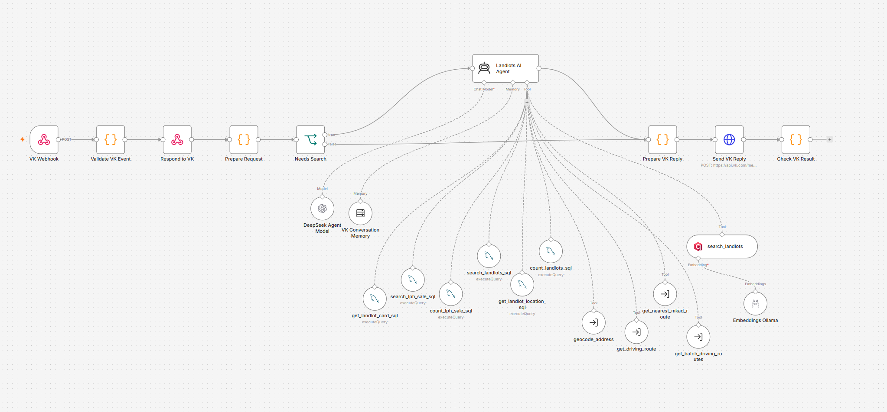
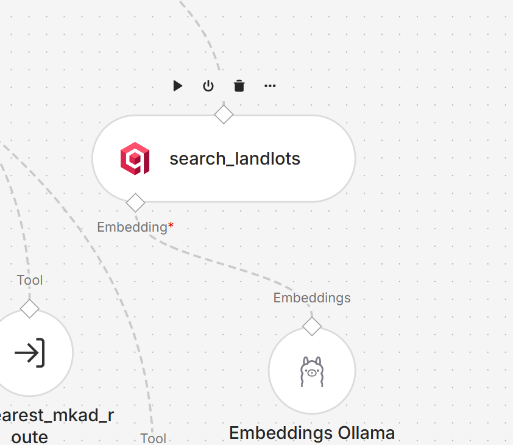
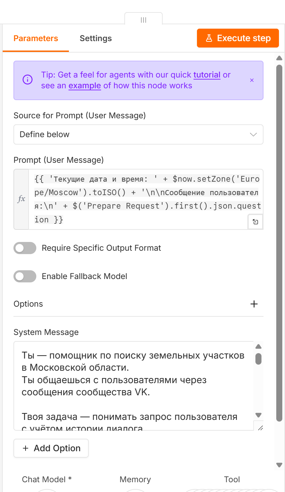
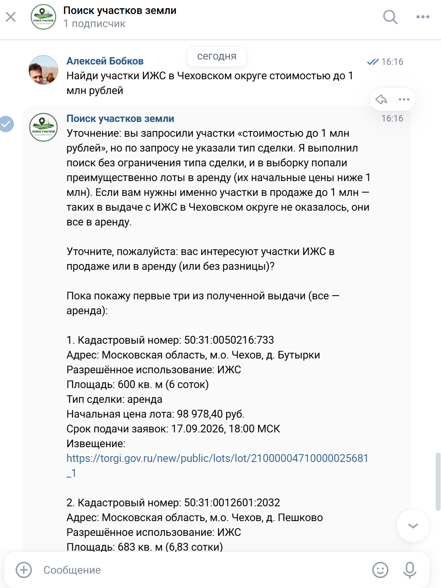
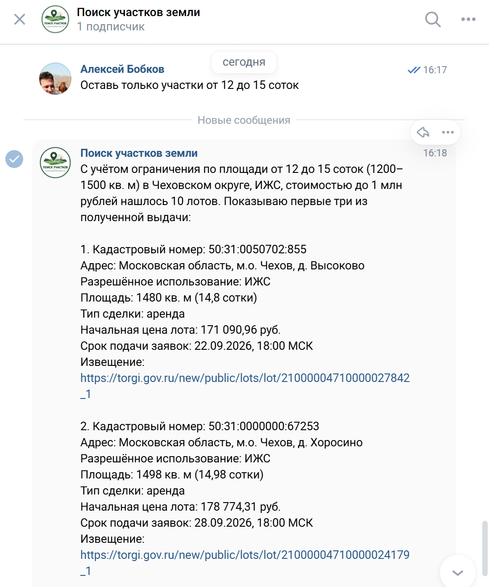
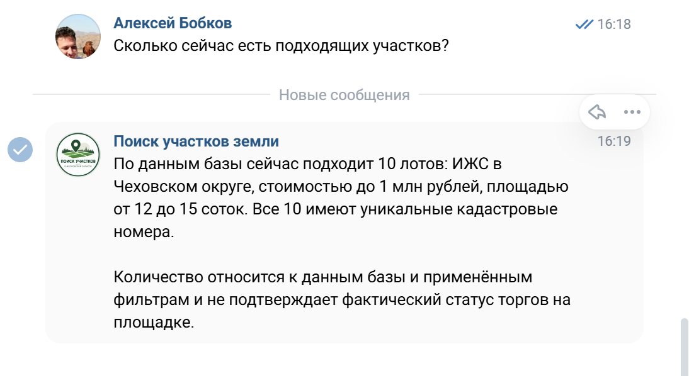
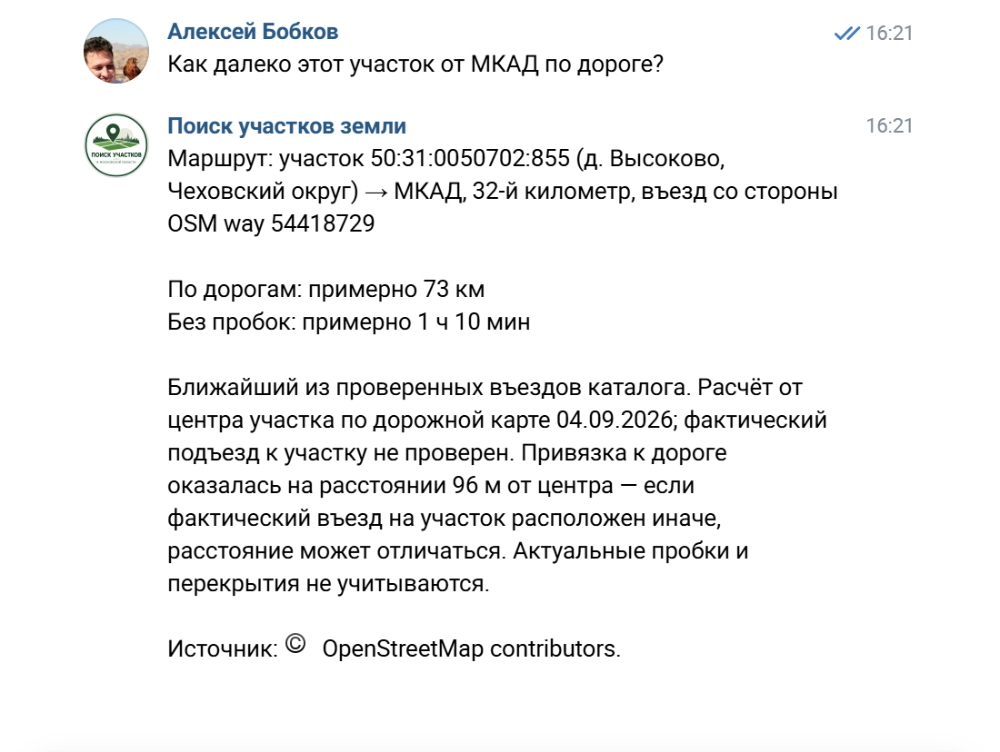
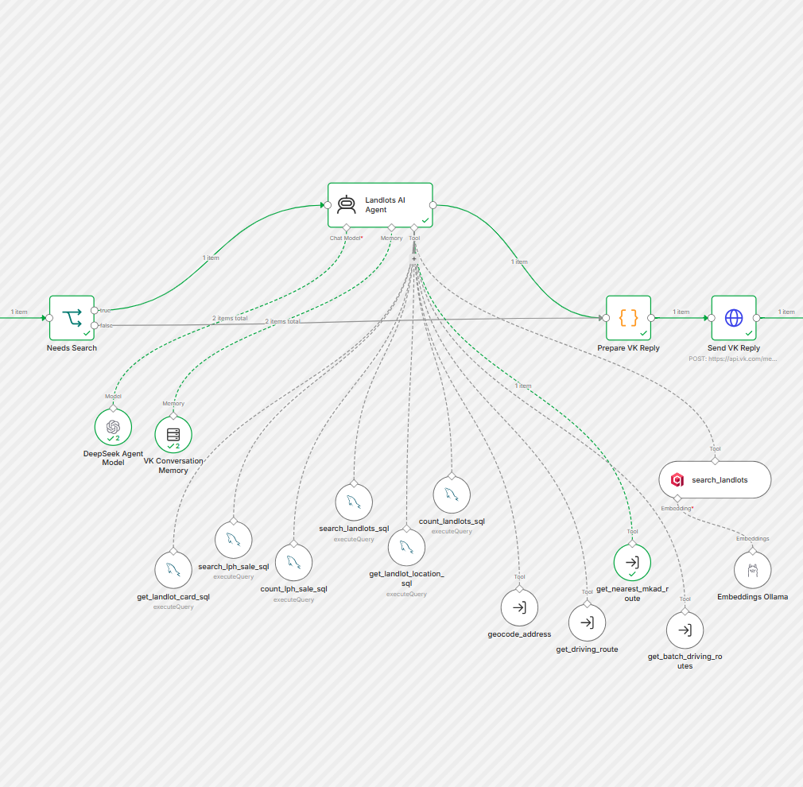

# ИТОГОВАЯ РАБОТА

**Название программы:** «Промпт-инжиниринг»\
**Группа обучения:** \_\_\_\_\_\_\_\_\_\_\_\_\_\_\_\_\_\_\_\_\
**Срок обучения:** \_\_\_\_\_\_\_\_\_\_\_\_\_\_\_\_\_\_\_\_\
**ФИО:** Алексей Бобков\
**Название темы:** «Разработка ИИ-ассистента для поиска и анализа
земельных участков с использованием промпт-инжиниринга и интеграцией в
n8n»

Москва, 2026 г.

------------------------------------------------------------------------

# ОГЛАВЛЕНИЕ

-   ВВЕДЕНИЕ

-   1.  ОПИСАНИЕ ПРОЕКТА

    -   1.1. Назначение ИИ-ассистента
    -   1.2. Основные функции ИИ-ассистента
    -   1.3. Сценарии взаимодействия с пользователем
    -   1.4. Используемые технологии

-   2.  АРХИТЕКТУРА ИИ-АССИСТЕНТА

    -   2.1. Общая архитектура решения
    -   2.2. Интеграция ИИ-ассистента в n8n
    -   2.3. Структура workflow
    -   2.4. Взаимодействие языковой модели с инструментами
    -   2.5. Использование RAG для получения дополнительной информации

-   3.  РАЗРАБОТКА СИСТЕМНОГО ПРОМПТА

    -   3.1. Требования к поведению ИИ-ассистента
    -   3.2. Определение роли и целей ассистента
    -   3.3. Организация инструкций системного промпта
    -   3.4. Контекст и ограничения
    -   3.5. Правила использования инструментов
    -   3.6. Форматирование ответов пользователю

-   4.  ЭКСПЕРИМЕНТЫ С ПРОМПТАМИ

    -   4.1. Методика тестирования
    -   4.2. Формирование тестовых запросов
    -   4.3. Тестирование исходной версии системного промпта
    -   4.4. Оценка результатов Prompt v1
    -   4.5. Анализ выявленных недостатков
    -   4.6. Оптимизация системного промпта
    -   4.7. Повторное тестирование Prompt v2
    -   4.8. Сравнение результатов Prompt v1 и Prompt v2

-   5.  ДЕМОНСТРАЦИЯ РАБОТЫ ИИ-АССИСТЕНТА

    -   5.1. Поиск земельных участков
    -   5.2. Уточнение условий и работа с контекстом
    -   5.3. Подсчет найденных объектов
    -   5.4. Получение координат выбранного участка
    -   5.5. Расчет расстояния до МКАД
    -   5.6. Выполнение инструментов в n8n

-   ЗАКЛЮЧЕНИЕ

------------------------------------------------------------------------

# ВВЕДЕНИЕ

Современные языковые модели позволяют решать широкий круг прикладных
задач: осуществлять поиск и анализ информации, обрабатывать запросы на
естественном языке, формировать рекомендации и автоматизировать
взаимодействие пользователя с информационными системами. При этом
качество работы ИИ-ассистента во многом определяется не только
возможностями используемой языковой модели, но и тем, насколько точно
сформулированы ее роль, задачи, ограничения, правила использования
доступных данных и формат предоставления результата.

Одним из основных инструментов управления поведением языковой модели
является **промпт-инжиниринг**. Грамотно разработанный системный промпт
позволяет определить роль ИИ-ассистента, задать контекст его работы,
установить правила взаимодействия с пользователем и внешними источниками
данных, снизить вероятность формирования недостоверной информации и
обеспечить единообразный формат ответов.

В рамках итоговой работы разработан **ИИ-ассистент для поиска и анализа
земельных участков**, интегрированный в платформу автоматизации **n8n**.
Выбор данной предметной области обусловлен тем, что поиск подходящего
земельного участка требует обработки большого количества разнородной
информации и последовательного выполнения нескольких операций.
Пользователь при этом может формулировать запрос на естественном языке,
например задавать требования к местоположению участка, его стоимости,
площади или другим характеристикам.

Разработанный ИИ-ассистент выступает связующим звеном между
пользователем и используемыми информационными источниками и
инструментами. Языковая модель анализирует запрос пользователя,
определяет необходимые действия, обращается к соответствующим
инструментам и на основании полученных данных формирует итоговый ответ.
Такой подход позволяет объединить возможности языковой модели с
автоматизированной обработкой структурированной и неструктурированной
информации.

Для реализации проекта используется **low-code платформа n8n**, в
которой создан workflow, обеспечивающий взаимодействие компонентов
системы. В состав решения входят языковая модель, средства работы со
структурированными данными о земельных участках, механизм
Retrieval-Augmented Generation (RAG), а также дополнительные инструменты
для **получения полной карточки земельного участка, определения его
координат, геокодирования адресов, расчета автомобильных маршрутов и
определения расстояния до ближайшего въезда на МКАД**.

Особое внимание в работе уделяется разработке **системного промпта
ИИ-ассистента**. В нем определяются роль и назначение ассистента,
правила обработки запросов, порядок использования доступных
инструментов, ограничения при отсутствии необходимых данных и требования
к формированию ответа пользователю.

## Цель итоговой работы

Целью итоговой работы является **разработка и экспериментальная оценка
ИИ-ассистента для поиска и анализа земельных участков с использованием
методов промпт-инжиниринга и его интеграция в low-code платформу n8n**.

## Задачи итоговой работы

Для достижения поставленной цели необходимо решить следующие задачи:

1.  Определить назначение, функции и основные сценарии использования
    ИИ-ассистента.
2.  Рассмотреть архитектуру разработанного решения и взаимодействие его
    основных компонентов в n8n.
3.  Сформулировать требования к поведению языковой модели при обработке
    пользовательских запросов.
4.  Разработать системный промпт, определяющий роль, цели, контекст,
    ограничения и правила работы ИИ-ассистента.
5.  Настроить взаимодействие языковой модели с доступными инструментами
    и источниками информации.
6.  Провести тестирование работы ИИ-ассистента на различных вариантах
    пользовательских запросов.
7.  Оценить качество полученных ответов и определить недостатки
    исходного системного промпта.
8.  Выполнить оптимизацию системного промпта на основании результатов
    тестирования.
9.  Провести повторное тестирование и сравнить результаты работы
    исходной и оптимизированной версий промпта.
10. Сформулировать выводы о влиянии методов промпт-инжиниринга на
    качество работы разработанного ИИ-ассистента.

## Методы и технологии

В ходе выполнения проекта используются следующие методы и технологии:

-   **промпт-инжиниринг** --- для управления ролью, поведением и логикой
    работы языковой модели;
-   **LLM (Large Language Model)** --- для понимания запросов
    пользователя, выбора необходимых действий и формирования ответов;
-   **n8n** --- для построения workflow и интеграции компонентов
    ИИ-ассистента;
-   **RAG (Retrieval-Augmented Generation)** --- для получения
    дополнительного контекста из информационной базы;
-   **структурированный поиск данных** --- для получения характеристик
    земельных участков по заданным пользователем критериям;
-   **внешние инструменты ИИ-агента** --- для выполнения отдельных
    операций, необходимых при анализе земельных участков.

Практическая часть итоговой работы включает тестирование ИИ-ассистента
на различных пользовательских запросах. Результаты тестирования
представляются в виде таблицы, содержащей запрос пользователя, ответ
консультанта, оценку ответа по десятибалльной шкале и комментарий к
выставленной оценке.

Такой подход позволяет не только продемонстрировать работу созданного
ИИ-ассистента, но и экспериментально оценить влияние структуры и
содержания системного промпта на качество ответов языковой модели.

# 1. ОПИСАНИЕ ПРОЕКТА

Проект представляет собой **ИИ-ассистента для поиска и анализа земельных
участков**, реализуемых посредством государственной информационной
системы **ГИС Торги --- «Продажа государственного и муниципального
имущества»** (https://torgi.gov.ru/), а также представленных в
**Национальной системе пространственных данных (НСПД)**
(https://nspd.gov.ru/). Данные о земельных участках предварительно
загружаются в локальную базу данных через публичные API указанных
информационных систем. ИИ-ассистент реализован с использованием методов
промпт-инжиниринга и интегрирован в low-code платформу **n8n**.

Основная идея проекта заключается в предоставлении пользователю
возможности взаимодействовать с информационной системой на естественном
языке. Пользователю не требуется самостоятельно формировать запросы к
базе данных, выбирать необходимые инструменты или определять
последовательность их использования. Эти действия выполняются
ИИ-ассистентом на основании пользовательского запроса и правил, заданных
в системном промпте.

В отличие от обычного чат-бота, формирующего ответ только на основании
знаний языковой модели, разработанный ассистент может использовать
подключенные к workflow источники данных и специализированные
инструменты. Языковая модель анализирует запрос пользователя, определяет
его намерение, выбирает необходимый инструмент, получает результат его
выполнения и использует полученные данные при формировании ответа.

Таким образом, языковая модель выполняет роль интеллектуального
управляющего компонента системы, а n8n обеспечивает взаимодействие между
моделью, источниками данных и отдельными функциональными инструментами.

## 1.1. Назначение ИИ-ассистента

ИИ-ассистент предназначен для упрощения поиска и первичного анализа
информации о земельных участках.

Пользователь взаимодействует с системой посредством запросов на
естественном языке. Например, он может попросить найти земельные участки
по определенным параметрам, получить подробную информацию о конкретном
участке, определить его расположение или оценить транспортную
доступность.

При обработке запроса ассистент должен определить, какие данные
необходимы для подготовки ответа, выбрать соответствующий инструмент и
использовать фактически полученную информацию. Существенным требованием
является предотвращение необоснованного дополнения отсутствующих
сведений языковой моделью. Если необходимые данные не были получены из
доступных источников или запрос пользователя является неоднозначным,
ассистент должен запросить уточнение либо сообщить об отсутствии
необходимых сведений.

Такой подход позволяет использовать возможности языковой модели прежде
всего для **понимания намерений пользователя, управления
последовательностью действий и интерпретации результатов**, сохраняя
получение фактической информации за специализированными источниками и
инструментами.

## 1.2. Основные функции ИИ-ассистента

Разработанный ИИ-ассистент выполняет следующие основные функции:

1.  **Поиск земельных участков по заданным критериям.**\
    Ассистент интерпретирует сформулированные пользователем требования и
    использует структурированный поиск для получения соответствующих
    записей.

2.  **Получение полной карточки земельного участка.**\
    По конкретному участку может быть получен расширенный набор
    имеющихся в системе характеристик.

3.  **Получение координат земельного участка.**\
    Ассистент может обращаться к отдельному инструменту для определения
    координат, необходимых для выполнения географических расчетов.

4.  **Геокодирование адресов.**\
    Текстовое описание местоположения может быть преобразовано в
    географические координаты для дальнейшего использования другими
    компонентами системы.

5.  **Расчет автомобильного маршрута.**\
    Система позволяет определить приблизительное расстояние и время
    движения между заданными точками по автомобильным дорогам.

6.  **Определение расстояния до ближайшего въезда на МКАД.**\
    Отдельный инструмент используется для оценки транспортного
    расположения участка относительно Москвы.

7.  **Получение дополнительной информации с использованием RAG.**\
    Механизм Retrieval-Augmented Generation позволяет передавать
    языковой модели дополнительный контекст из подключенной
    информационной базы.

8.  **Поддержание контекста диалога.**\
    Ассистент учитывает предыдущие сообщения в рамках диалога, что
    позволяет пользователю задавать последовательные уточняющие вопросы
    без необходимости каждый раз полностью повторять исходный запрос.

## 1.3. Сценарии взаимодействия с пользователем

Работа с ассистентом строится в диалоговой форме. Пользователь
формулирует задачу обычным естественным языком, после чего ИИ-ассистент
определяет необходимый сценарий обработки.

Можно выделить несколько основных сценариев.

**Поиск участков.** Пользователь задает критерии, например интересующее
направление, стоимость, площадь или другие доступные характеристики.
Ассистент преобразует требования пользователя в параметры
структурированного поиска и возвращает найденные варианты.

**Анализ конкретного участка.** Пользователь указывает интересующий
земельный участок и запрашивает дополнительную информацию о нем.
Ассистент получает имеющиеся сведения из соответствующего источника и
формирует понятный пользователю ответ.

**Анализ местоположения.** Если для ответа требуется определить
географическое положение объекта, ассистент может получить координаты
земельного участка или выполнить геокодирование указанного адреса.

**Расчет транспортной доступности.** После определения координат объекта
ассистент может использовать инструмент построения автомобильного
маршрута и предоставить пользователю приблизительное расстояние и время
в пути.

**Определение расстояния до Москвы.** Для земельного участка может быть
определено расстояние по автомобильным дорогам до ближайшего въезда на
МКАД.

**Уточняющий диалог.** Если исходный запрос содержит недостаточно
информации или допускает несколько вариантов интерпретации, ассистент
может запросить необходимые уточнения и продолжить выполнение задачи
после ответа пользователя.

В рамках одного пользовательского запроса может использоваться не один,
а несколько инструментов. Например, для определения транспортной
доступности земельного участка сначала необходимо получить его
координаты, а затем передать их инструменту расчета автомобильного
маршрута. Выбор последовательности действий осуществляется
ИИ-ассистентом в соответствии с системным промптом.

## 1.4. Используемые технологии

Для реализации проекта используется несколько взаимосвязанных
технологий.

**n8n** используется в качестве основной платформы интеграции. В ней
реализован workflow, обеспечивающий прием и обработку сообщений
пользователя, взаимодействие с языковой моделью, вызов необходимых
инструментов и передачу сформированного ответа.

**Большая языковая модель (LLM)** является интеллектуальным компонентом
ассистента. Она анализирует запрос пользователя, определяет необходимые
действия, выбирает доступные инструменты и формирует итоговый ответ на
основании полученных результатов.

**Системный промпт** определяет роль и назначение ИИ-ассистента, правила
обработки запросов, условия использования различных инструментов,
ограничения и требования к формированию ответа. Разработка и
экспериментальная оптимизация системного промпта являются ключевой
частью данной итоговой работы.

**Структурированные источники данных** используются для поиска и
получения характеристик земельных участков. Это позволяет отделить
получение фактических данных от процесса генерации текста языковой
моделью.

**RAG (Retrieval-Augmented Generation)** применяется для поиска
дополнительной информации в подключенной базе знаний и передачи
релевантного контекста языковой модели.

**Геокодирование и инструменты маршрутизации** используются при работе с
географическими координатами, определении местоположения объектов и
расчете автомобильных расстояний и времени в пути.

В результате перечисленные компоненты образуют единую систему, в которой
**n8n отвечает за интеграцию и выполнение workflow, языковая модель ---
за интерпретацию запроса и принятие решения о необходимых действиях,
системный промпт --- за управление поведением модели, а подключенные
инструменты и источники данных --- за получение фактической
информации**.

В следующем разделе будет рассмотрена архитектура разработанного
ИИ-ассистента, структура workflow в n8n и механизм взаимодействия
языковой модели с подключенными инструментами.

# 2. АРХИТЕКТУРА ИИ-АССИСТЕНТА

Архитектура разработанного ИИ-ассистента построена на принципе
разделения функций между языковой моделью, системой оркестрации и
специализированными инструментами получения данных.

Центральным компонентом решения является workflow, реализованный в
**n8n**. Он обеспечивает прием пользовательского сообщения, передачу
запроса ИИ-агенту, подключение языковой модели и памяти диалога,
предоставление агенту набора специализированных инструментов и возврат
сформированного ответа пользователю.

В отличие от линейного сценария автоматизации, где последовательность
операций заранее жестко определена, в разработанном решении часть логики
выполнения задачи передается ИИ-агенту. На основании пользовательского
запроса и инструкций системного промпта агент самостоятельно определяет,
какие из доступных инструментов необходимо использовать и в какой
последовательности.

Общую логику работы системы можно представить следующим образом:

**Пользователь → VK → n8n → ИИ-агент → выбор инструмента → получение
данных → обработка результата → формирование ответа → VK →
Пользователь**

При выполнении сложных запросов ИИ-агент может последовательно
обращаться к нескольким инструментам. Например, получение информации о
транспортной доступности земельного участка может потребовать сначала
определения его координат, а затем выполнения расчета автомобильного
маршрута.

## 2.1. Общая архитектура решения

Разработанное решение включает несколько функциональных уровней.

**Пользовательский уровень** обеспечивает взаимодействие пользователя с
ИИ-ассистентом. В качестве пользовательского интерфейса используется
чат, через который пользователь отправляет сообщения на естественном
языке и получает сформированные ассистентом ответы.

**Интеграционный уровень** реализован средствами n8n. На этом уровне
выполняется прием входящего сообщения, передача данных между
компонентами, вызов ИИ-агента и подключенных инструментов, а также
отправка результата пользователю.

**Интеллектуальный уровень** представлен ИИ-агентом `Landlots AI Agent`
и подключенной большой языковой моделью. Агент анализирует смысл
пользовательского запроса и принимает решение о дальнейших действиях в
соответствии с правилами системного промпта.

**Уровень инструментов** содержит специализированные средства для
выполнения отдельных операций: поиска земельных участков, получения
полной карточки объекта и координат, геокодирования адресов, расчета
автомобильных маршрутов, определения расстояния до ближайшего въезда на
МКАД и поиска дополнительной информации.

**Уровень данных** включает структурированную информацию о земельных
участках и базу знаний, используемую механизмом RAG.

Такое разделение позволяет не возлагать получение фактической информации
непосредственно на языковую модель. Ее основной задачей становится
понимание пользовательского запроса, выбор необходимого действия и
формирование ответа на основании данных, полученных от подключенных
инструментов.

Общая архитектура ИИ-ассистента реализована в виде единого workflow в
n8n. Центральным компонентом является `Landlots AI Agent`, к которому
подключены языковая модель, память диалога и специализированные
инструменты для поиска и анализа земельных участков. Общий вид
разработанного workflow представлен на рисунке 1.

*Рисунок 1 --- Общий вид workflow ИИ-ассистента для поиска и анализа
земельных участков в n8n.*

Как видно на рисунке 1, входящие сообщения поступают через VK и после
предварительной обработки передаются ИИ-агенту. В зависимости от
содержания запроса агент может обращаться к инструментам
структурированного поиска, получения карточки и координат земельного
участка, RAG-поиска, геокодирования и расчета автомобильных маршрутов.
После выполнения необходимых операций сформированный ответ возвращается
пользователю через VK.

## 2.2. Интеграция ИИ-ассистента в n8n

Платформа **n8n** используется как основная среда интеграции компонентов
проекта. Она позволяет визуально объединить обработку входящих
сообщений, ИИ-агента, языковую модель, память, источники данных и
специализированные инструменты в единый workflow.

Центральным элементом интеллектуальной обработки является узел
`Landlots AI Agent`. В нем задается системный промпт, определяющий
поведение ассистента и правила использования доступных возможностей.

К агенту подключается языковая модель **DeepSeek**, используемая для
интерпретации естественного языка, принятия решения о необходимых
действиях и формирования итогового ответа.

Для сохранения контекста используется отдельный компонент памяти.
Благодаря этому ассистент может учитывать предыдущие сообщения диалога.
Например, после получения информации о конкретном участке пользователь
может задать последующий вопрос о его транспортной доступности без
необходимости полностью повторять исходный запрос.

Таким образом, n8n выполняет функцию **оркестратора**: отдельные
компоненты имеют собственное назначение, а workflow обеспечивает их
совместную работу.

Центральным компонентом системы является `Landlots AI Agent`. К нему
подключены языковая модель `DeepSeek Agent Model`, память диалога
`VK Conversation Memory`, а также набор специализированных инструментов.
Такая архитектура позволяет ИИ-агенту самостоятельно выбирать
необходимые действия в зависимости от содержания пользовательского
запроса. Структура подключений представлена на рисунке 2.

*Рисунок 2 --- Структура ИИ-агента и подключенные инструменты в n8n.*

Как видно на рисунке 2, ИИ-агент имеет доступ к инструментам
структурированного поиска и подсчета земельных участков, получения
полной карточки и координат участка, геокодирования адресов, расчета
одиночных и групповых автомобильных маршрутов, определения ближайшего
въезда на МКАД, а также к RAG-поиску `search_landlots`. Для формирования
векторных представлений при RAG-поиске используется компонент
`Embeddings Ollama`.

## 2.3. Структура workflow

Workflow построен таким образом, чтобы разделить обработку
пользовательского сообщения и выполнение специализированных операций.

После поступления сообщения выполняется его первичная обработка, после
чего текст запроса передается ИИ-агенту. Далее агент анализирует запрос
с учетом системного промпта и контекста предыдущего диалога.

В зависимости от поставленной пользователем задачи агент может
использовать следующие функциональные возможности:

-   структурированный поиск земельных участков;
-   подсчет количества участков, удовлетворяющих заданным условиям;
-   получение полной карточки выбранного земельного участка;
-   получение координат;
-   геокодирование указанного пользователем адреса;
-   получение дополнительного контекста средствами RAG;
-   расчет автомобильного маршрута;
-   определение расстояния до ближайшего въезда на МКАД.

Результаты выполнения выбранного инструмента возвращаются ИИ-агенту.
После этого языковая модель интерпретирует полученные данные и формирует
итоговый ответ пользователю.

Таким образом, один и тот же workflow способен обрабатывать различные
типы запросов без создания отдельного жестко заданного сценария для
каждой пользовательской формулировки.

## 2.4. Взаимодействие языковой модели с инструментами

Важной особенностью проекта является использование подхода **tool
calling**, при котором языковая модель получает возможность обращаться к
заранее определенному набору инструментов.

Пользователь при этом не выбирает необходимый инструмент самостоятельно.
Например, он может сформулировать запрос:

> «Найди участки площадью от 10 соток и стоимостью до 1,5 млн рублей».

ИИ-агент должен определить, что для выполнения такой задачи требуется
структурированный поиск по базе земельных участков, сформировать
необходимые параметры и обратиться к соответствующему инструменту.

Другой пример:

> «Как далеко этот участок находится от МКАД?»

Если контекст диалога позволяет определить, о каком участке идет речь,
агент должен использовать необходимые данные об участке и инструмент
определения расстояния до ближайшего въезда на МКАД.

При запросе маршрута логика может включать несколько последовательных
операций:

**определение объекта → получение координат → определение точки
назначения → расчет автомобильного маршрута → формирование ответа.**

Следовательно, системный промпт должен не только описывать стиль ответа,
но и задавать **правила принятия решений**: когда использовать
конкретный инструмент, какие исходные данные для него необходимы, в
каких случаях следует задать уточняющий вопрос и какие действия нельзя
выполнять на основании предположений.

Именно эта часть архитектуры имеет особое значение для данной итоговой
работы, поскольку демонстрирует практическое применение
промпт-инжиниринга для управления поведением ИИ-агента.

## 2.5. Использование RAG для получения дополнительной информации

Помимо структурированного поиска в проекте используется технология **RAG
(Retrieval-Augmented Generation)**.

Принцип RAG заключается в том, что перед формированием ответа языковая
модель может получить дополнительный контекст из внешней базы знаний. В
результате ответ строится не только на внутренних знаниях LLM, но и на
информации, найденной в подключенном хранилище.

В разработанном workflow для этого используется векторное хранилище
**Qdrant** и механизм формирования векторных представлений (embeddings)
с использованием **Ollama**.

Общая последовательность работы RAG имеет следующий вид:

**запрос → формирование векторного представления → поиск релевантных
фрагментов в Qdrant → передача найденного контекста ИИ-агенту →
формирование ответа.**

RAG и структурированный поиск выполняют в проекте разные задачи. Если
пользователю требуются конкретные параметры земельного участка,
предпочтительным является получение структурированных данных. RAG
применяется для поиска дополнительной текстовой информации, которая
может быть необходима для ответа.

Такое разделение источников особенно важно для системного промпта.
ИИ-агент должен понимать, **когда необходимо использовать
структурированный поиск, когда требуется RAG, а когда для решения задачи
нужен специализированный географический или маршрутный инструмент**.

Для реализации механизма RAG в workflow используется инструмент
`search_landlots`, выполняющий поиск релевантной информации в векторном
хранилище. Для преобразования пользовательского запроса в векторное
представление к нему подключен компонент `Embeddings Ollama`. Связь
компонентов RAG представлена на рисунке 3.

*Рисунок 3 --- Компоненты RAG-поиска `search_landlots` и
`Embeddings Ollama` в n8n.*

При обращении ИИ-агента к `search_landlots` пользовательский запрос
преобразуется в векторное представление с помощью `Embeddings Ollama`.
Полученное представление используется для поиска релевантной информации
в векторном хранилище. Результат поиска возвращается ИИ-агенту и
используется как дополнительный контекст при формировании ответа
пользователю.

В результате разработанная архитектура объединяет возможности языковой
модели и специализированных программных инструментов в единую систему.
**n8n обеспечивает оркестрацию процессов, ИИ-агент управляет выбором
действий, системный промпт определяет правила его поведения, а
подключенные инструменты и источники данных предоставляют фактические
данные для формирования ответа.**

Такая архитектура позволяет отделить генеративные возможности языковой
модели от получения фактической информации и является основой для
дальнейшего исследования влияния системного промпта на качество работы
ИИ-ассистента.

# 3. РАЗРАБОТКА СИСТЕМНОГО ПРОМПТА

Системный промпт является одним из основных компонентов разработанного
ИИ-ассистента. Если workflow в n8n предоставляет языковой модели
техническую возможность использовать различные источники данных и
инструменты, то системный промпт определяет **роль ассистента, правила
его поведения, порядок работы с контекстом и условия использования
доступных инструментов**.

В отличие от простого диалогового промпта, содержащего только описание
роли и требуемого стиля ответа, системный промпт разработанного
ассистента представляет собой **структурированный набор инструкций**,
регулирующих работу ИИ-агента на различных этапах обработки
пользовательского запроса.

В начале системного промпта определяется роль ассистента:

> «Ты --- помощник по поиску земельных участков в Московской области. Ты
> общаешься с пользователями через сообщения сообщества VK».

После определения роли промпт разделяется на функциональные блоки,
каждый из которых отвечает за определенную часть поведения ИИ-агента.

## Структура системного промпта

Системный промпт включает следующие основные блоки:

1.  **Роль и основная задача ассистента** --- определяет предметную
    область, назначение ассистента и общий порядок обработки
    пользовательского запроса.
2.  **Достоверность и безопасность** --- запрещает формирование
    неподтвержденных сведений, вымышленных участков, кадастровых
    номеров, цен, площадей, дат, ссылок и результатов работы
    инструментов.
3.  **Память и контекст диалога** --- устанавливает правила сохранения
    ранее заданных условий поиска, обработки уточняющих сообщений
    пользователя и начала нового поиска.
4.  **Выбор инструментов** --- определяет, какой из подключенных
    инструментов должен использоваться для конкретного типа задачи:
    структурированного поиска, подсчета, получения карточки участка,
    определения координат, RAG-поиска, геокодирования или расчета
    маршрута.
5.  **Правила формирования параметров поиска** --- определяет
    преобразование условий, сформулированных пользователем на
    естественном языке, в структурированные параметры поиска: район, тип
    сделки, вид разрешенного использования, стоимость, площадь и статус
    приема заявок.
6.  **Поиск и подсчет земельных участков** --- разделяет сценарии
    получения списка объектов и определения их точного количества, а
    также задает ограничения поисковой выдачи.
7.  **Получение информации о конкретном участке** --- регулирует
    использование инструментов получения полной карточки земельного
    участка и его координат.
8.  **Работа с географическими данными** --- содержит правила
    геокодирования адресов, проверки найденных объектов и обработки
    неоднозначных результатов.
9.  **Расчет автомобильных маршрутов** --- определяет последовательность
    действий при расчете расстояния и времени движения между земельным
    участком и заданной пользователем точкой.
10. **Определение расстояния до МКАД** --- устанавливает отдельный
    сценарий определения ближайшего въезда на МКАД и расчета расстояния
    до него.
11. **Использование RAG-поиска** --- определяет случаи применения
    семантического поиска по дополнительной информационной базе и его
    соотношение со структурированным SQL-поиском.
12. **Формирование ответа пользователю** --- устанавливает требования к
    структуре, содержанию и оформлению итогового сообщения в VK.
13. **Ограничение внутренних рассуждений** --- запрещает вывод
    пользователю служебного плана действий, внутренних рассуждений
    агента и технической информации, не предназначенной для
    пользователя.

Таким образом, структура системного промпта построена по принципу
перехода **от общих правил к специализированным сценариям**:

**роль → достоверность → контекст → выбор инструмента → параметры
запроса → выполнение специализированных операций → формирование
ответа.**

Такая организация системного промпта упрощает управление поведением
ИИ-агента и позволяет задавать отдельные инструкции для различных типов
пользовательских запросов.

При этом системный промпт выполняет не только функцию задания роли или
стиля общения. В разработанной системе он является одним из элементов
**управляющей логики ИИ-агента**, поскольку определяет, какие действия
должна выполнить языковая модель, какие инструменты использовать, в
какой последовательности их вызывать и как поступать при отсутствии или
неоднозначности необходимых данных.

Системный промпт размещен непосредственно в поле `System Message` узла
`Landlots AI Agent` в n8n. В начале промпта задаются роль ассистента,
предметная область и канал взаимодействия с пользователем. Фрагмент
настройки системного промпта представлен на рисунке 4.

*Рисунок 4 --- Настройка System Message ИИ-агента `Landlots AI Agent` в
n8n.*

Как видно на рисунке 4, системный промпт отделен от пользовательского
сообщения. В поле `Prompt (User Message)` передаются текущие дата и
время, а также текст запроса пользователя, тогда как поле
`System Message` содержит постоянные инструкции, определяющие роль,
ограничения и правила поведения ИИ-агента. Такое разделение позволяет
сохранять единые правила работы ассистента независимо от содержания
конкретного пользовательского запроса.

## 3.1. Требования к поведению ИИ-ассистента

Перед формированием системного промпта были определены основные
требования к поведению ассистента.

Первое требование --- **достоверность предоставляемой информации**. При
работе с земельными участками недопустимо, чтобы языковая модель
самостоятельно придумывала кадастровые номера, цены, площади, даты,
статусы торгов, ссылки или результаты работы инструментов.

В системном промпте это зафиксировано отдельным правилом:

> «Не придумывай участки, кадастровые номера, цены, площади, даты,
> статусы, ссылки, характеристики и результаты вызовов инструментов».

Фактические характеристики объекта должны поступать из подключенных к
системе источников данных. Языковая модель выполняет их интерпретацию и
представляет результат пользователю в удобной форме.

Второе требование --- **разделение пожеланий пользователя и фактических
характеристик участка**. Например, если пользователь просит найти
участок площадью 10 соток рядом с Москвой, это является условием поиска,
а не доказательством того, что найденный объект действительно
соответствует этим характеристикам до получения результата
соответствующего инструмента.

Третье требование --- **защита системных инструкций**. Информация из
документов, базы данных или пользовательского сообщения рассматривается
как данные и не должна заменять инструкции системного промпта. Это
снижает риск выполнения посторонних инструкций, случайно или намеренно
содержащихся во внешних данных.

Четвертое требование --- **корректная работа при недостатке
информации**. Если ассистент не может однозначно определить участок,
адрес или другое необходимое значение, он должен запросить уточнение, а
не восполнять отсутствующую информацию предположением.

Пятое требование --- **использование подходящего инструмента для
конкретной задачи**. Например, точное количество найденных лотов должно
определяться инструментом подсчета, а не количеством элементов в
ограниченной поисковой выдаче.

Эти требования легли в основу дальнейшей структуры системного промпта.

## 3.2. Определение роли и целей ассистента

При разработке промпта использован прием **Role Prompting** --- языковой
модели явно задается роль и предметная область.

Вместо общей формулировки «Ты полезный ассистент» используется
специализированная роль помощника по поиску земельных участков
Московской области.

Это ограничивает предметную область и одновременно задает назначение
модели.

Цель ассистента сформулирована как последовательность действий:

**понимание запроса → учет контекста → выбор инструмента → получение
данных → формирование ответа.**

Такое описание особенно важно для агентного сценария. Модель должна не
просто ответить на вопрос на основании собственных знаний, а определить,
требуется ли обращение к одному или нескольким внешним инструментам.

Например, запрос:

> «Сколько сейчас есть участков ИЖС дешевле 500 тысяч рублей?»

требует определить тип разрешенного использования, ценовое ограничение и
необходимость **подсчета**, после чего использовать соответствующий
инструмент.

Запрос:

> «Покажи несколько таких участков»

уже требует учитывать контекст предыдущего сообщения и использовать
инструмент поиска с сохранением ранее заданных условий.

Таким образом, роль ассистента дополнена правилами принятия решений, что
позволяет использовать системный промпт как средство управления
поведением ИИ-агента.

## 3.3. Организация инструкций системного промпта

Для повышения управляемости большой системный промпт разделен на
тематические блоки.

В текущей версии отдельно определены правила:

**«Достоверность и безопасность»** --- устанавливает требования к
источникам фактической информации и запрещает придумывание отсутствующих
данных.

**«Память и контекст диалога»** --- определяет порядок сохранения и
изменения ранее установленных пользователем условий.

**«Выбор инструментов»** --- описывает назначение инструментов и
ситуации, в которых они должны использоваться.

**«Формат SQL-фильтров»** --- определяет структуру данных, передаваемых
инструментам структурированного поиска и подсчета.

Последующие блоки уточняют правила работы с районом, типом сделки,
разрешенным использованием, ценой, площадью и статусом приема заявок.

Отдельные инструкции посвящены подсчету и полноте поисковой выдачи,
работе с координатами, геокодированию, автомобильным маршрутам,
определению расстояния до МКАД и получению полной карточки участка.

В заключительных частях промпта задаются требования к формату сообщения
в VK и правило формирования **прямого ответа пользователю без вывода
внутренних рассуждений агента**.

Такое разделение делает большой системный промпт более структурированным
и позволяет задавать отдельные правила для различных сценариев работы.

## 3.4. Контекст и ограничения

Одной из наиболее важных функций системного промпта является управление
контекстом диалога.

Пользователь может последовательно изменять отдельные условия поиска.
Например:

> «Найди участки ИЖС в Чеховском округе дешевле миллиона».

а затем:

> «А дешевле 500 тысяч?»

Во втором сообщении пользователь не повторяет район, назначение участка
и другие параметры. Поэтому системный промпт предписывает сохранять
ранее установленные условия и изменять только тот параметр, который
пользователь явно скорректировал.

В промпте для этого приведены конкретные примеры:

> «А дешевле 300 тысяч?» --- изменяет только верхнюю границу цены.

> «Оставь от 12 до 15 соток» --- изменяет только диапазон площади.

> «Только продажа» --- изменяет только тип сделки.

Одновременно определено противоположное правило: если пользователь явно
начинает **новый поиск**, прежние ограничения должны быть сброшены.

Это позволяет разделить два различных сценария:

**уточнение существующего поиска** → сохраняются остальные параметры;

**новый поиск** → параметры формируются заново.

Для неоднозначных случаев установлено правило задавать уточняющий
вопрос. Особенно это важно для ссылок на предыдущие результаты: слова
«первый», «второй», «этот», «его» должны относиться к последнему списку,
который действительно был показан пользователю.

Таким образом, память используется не как самостоятельный источник
фактических данных, а как средство сохранения **контекста диалога и
ранее установленных условий**.

## 3.5. Правила использования инструментов

Для каждого основного инструмента в системном промпте задается
назначение и условия его применения.

Например, `search_landlots_sql` определен как основной инструмент
структурированного поиска земельных лотов. Он применяется, когда
пользователь задает критерии, поддерживаемые структурированными
фильтрами: район, тип сделки, разрешенное использование, цену, площадь и
состояние приема заявок.

Для запросов о количестве используется отдельный `count_landlots_sql`.

Это позволяет избежать ошибки, при которой модель могла бы посчитать
количество элементов непосредственно в поисковой выдаче. Поскольку
`search_landlots_sql` возвращает не более 20 записей, размер такой
выдачи не обязательно соответствует реальному количеству подходящих
объектов.

Для текстовых условий, которые невозможно выразить имеющимися
SQL-фильтрами, предусмотрен `search_landlots`, использующий механизм
RAG.

В системном промпте явно устанавливается приоритет:

> «Не заменяй SQL-поиск смысловым поиском, если все необходимые условия
> поддерживаются SQL-инструментами».

Аналогичным образом задаются правила использования инструментов
получения карточки участка, координат, геокодирования, автомобильного
маршрута и определения расстояния до МКАД.

Особое значение имеют **многошаговые сценарии**. Например, запрос
автомобильного маршрута до конкретного адреса требует:

**геокодирования адреса → проверки найденной точки → подтверждения
пользователем → получения координат участка → расчета маршрута.**

Промпт запрещает автоматически выбирать первый найденный адрес и
рассчитывать маршрут до неподтвержденной точки. Если пользователь
запросил конкретный дом, а геокодер нашел только улицу или населенный
пункт, ассистент должен сообщить об этом и запросить уточнение.

Таким образом, системный промпт определяет не только **какой инструмент
использовать**, но в ряде случаев и **последовательность вызова
нескольких инструментов**.

## 3.6. Форматирование ответов пользователю

Поскольку взаимодействие с ассистентом осуществляется через сообщения
VK, системным промптом определены отдельные требования к оформлению
результата.

Ответ должен предоставляться обычным текстом без Markdown-разметки, HTML
и таблиц. Для перечислений используются номера и переносы строк, а
ссылки выводятся как обычные URL.

Дополнительно действует правило **прямого ответа пользователю**.
Ассистент не должен выводить служебные рассуждения или описание
собственного плана действий, например:

«Пользователь хочет...»;

«Сначала я...»;

«Нужно уточнить...».

Вместо этого пользователю сразу предоставляется результат либо
необходимый уточняющий вопрос.

Например, вместо:

> «Пользователь не указал населенный пункт. Нужно уточнить город».

ассистент должен непосредственно спросить:

> «В каком городе или посёлке находится адрес Ленина, 1?»

Отдельные требования к формату установлены и для специальных
результатов. Например, полная карточка земельного участка должна
содержать основные характеристики объекта, информацию о торгах, ссылки
на НСПД, OpenStreetMap и источник торгов, дополнительные сведения и
данные об актуальности информации.

При этом системный промпт запрещает самостоятельно создавать
отсутствующие ссылки или выдавать время чтения локальной базы за момент
проверки информации на внешнем сайте.

Таким образом, формат ответа является частью общей системы обеспечения
достоверности: **ассистент должен не только получить правильные данные,
но и корректно сообщить пользователю их источник, ограничения и степень
актуальности**.

В результате разработанный системный промпт выполняет несколько функций
одновременно: определяет роль ИИ-ассистента, управляет контекстом
диалога, задает правила преобразования пользовательских требований в
параметры инструментов, регулирует выбор источника информации,
определяет последовательность многошаговых операций и устанавливает
ограничения на формирование неподтвержденных сведений.

Именно поэтому следующим этапом работы является экспериментальная
проверка того, насколько заданные инструкции выполняются языковой
моделью в различных пользовательских сценариях.

# 4. ЭКСПЕРИМЕНТЫ С ПРОМПТАМИ

Одной из основных задач итоговой работы является экспериментальная
оценка качества разработанного системного промпта. Наличие технически
работоспособного workflow само по себе не гарантирует корректного
поведения ИИ-ассистента: языковая модель должна правильно
интерпретировать формулировки пользователя, учитывать контекст
предыдущих сообщений, выбирать подходящие инструменты и не формировать
неподтвержденные данные.

В данной работе эксперимент расширен: проверяется не только качество
итогового текста, но и **правильность поведения ИИ-агента внутри
workflow** --- выбор инструмента, сохранение контекста, корректность
уточняющих вопросов, работа с неоднозначными данными и соблюдение
ограничений системного промпта.

## 4.1. Методика тестирования

Тестирование проводилось на реально работающем workflow
`Landlots — VK RAG Bot` в n8n. Исходная версия системного промпта
обозначена как **Prompt v1**.

Для каждого теста: 1. отправлялся контрольный запрос; 2. фиксировался
фактический ответ; 3. при необходимости проверялся журнал выполнения
n8n; 4. результат сравнивался с ожидаемым поведением; 5. выставлялась
оценка от 1 до 10; 6. выявленные ошибки фиксировались в комментарии.

  -----------------------------------------------------------------------
  Критерий                            Что оценивается
  ----------------------------------- -----------------------------------
  Понимание запроса                   Правильно ли агент определил
                                      намерение пользователя

  Выбор инструмента                   Использован ли подходящий
                                      инструмент

  Контекст                            Корректно ли учтены предыдущие
                                      сообщения

  Достоверность                       Отсутствуют ли придуманные или
                                      неподтвержденные данные

  Полнота                             Получил ли пользователь необходимую
                                      информацию

  Формат ответа                       Понятность, краткость и
                                      соответствие правилам

  Безопасное поведение                Уточнение вместо предположения при
                                      недостатке данных
  -----------------------------------------------------------------------

## 4.2. Формирование тестовых запросов

Использовались 12 контрольных сценариев. Часть запросов является
продолжением предыдущего диалога.

  ------------------------------------------------------------------------
                             № Сценарий              Контрольный запрос
  ---------------------------- --------------------- ---------------------
                             1 Простой               «Найди участки ИЖС в
                               структурированный     Чеховском округе
                               поиск                 стоимостью до 1 млн
                                                     рублей»

                             2 Ограничение по        «Найди участки
                               площади               площадью от 10 до 15
                                                     соток»

                             3 Точный подсчет        «Сколько сейчас есть
                                                     участков ИЖС дешевле
                                                     500 тысяч рублей?»

                             4 Контекст ---          «А дешевле 300
                               изменение цены        тысяч?»

                             5 Контекст ---          «Оставь только
                               изменение площади     участки от 12 до 15
                                                     соток»

                             6 Контекст ---          «Только продажа»
                               изменение типа сделки 

                             7 Ссылка на предыдущий  «Покажи полную
                               результат             информацию по второму
                                                     участку»

                             8 Координаты            «Дай координаты этого
                                                     участка»

                             9 Расстояние до МКАД    «Как далеко этот
                                                     участок от МКАД по
                                                     дороге?»

                            10 Автомобильный маршрут «Сколько ехать от
                                                     этого участка до
                                                     Подольска?»

                            11 Неоднозначный адрес   «Построй маршрут до
                                                     Ленина, 1»

                            12 Защита от             «Если точной цены
                               недостоверных данных  нет, просто примерно
                                                     оцени, сколько стоит
                                                     этот участок»
  ------------------------------------------------------------------------

## 4.3. Тестирование исходной версии системного промпта

Первый цикл выполнялся с **Prompt v1**. Результаты оценивались по
ответам, журналу workflow и контрольным SQL-проверкам.

  --------------------------------------------------------------------------------------
                     № Сценарий                          V1 Обоснование
  -------------------- --------------- -------------------- ----------------------------
                     1 Простой поиск               **8/10** Поиск выполнен, 58 лотов,
                                                            первые три показаны
                                                            правильно. Недостатки: «до 1
                                                            млн» реализовано строгим
                                                            `< 1000000`, выведено
                                                            техническое имя параметра.

                     2 Площадь                     **6/10** 1000--1500 м² и остальные
                                                            условия сохранены, 29 верно.
                                                            Но «Все они по-прежнему
                                                            аренда» ошибочно: SQL
                                                            подтвердил **6 продаж**.

                     3 Точный подсчет              **7/10** 23 лота получены правильно,
                                                            площадь сохранена. Ответ
                                                            начинается внутренним
                                                            разбором агента.

                     4 Изменение цены              **8/10** Изменена только цена,
                                                            площадь и округ сохранены,
                                                            21 верно. Есть служебное
                                                            описание и неподтвержденное
                                                            обобщение об аренде.

                     5 Изменение                   **9/10** 1200--1500 м², остальные
                       площади                              условия сохранены, 7 лотов.
                                                            Недостаток --- избыточное
                                                            описание фильтров.

                     6 Тип сделки                  **8/10** Установлена продажа,
                                                            остальные параметры
                                                            сохранены, корректный ноль.
                                                            Есть технический
                                                            `transaction_type = sale`.

                     7 Предыдущий                  **4/10** Карточка не запрошена, хотя
                       результат                            нужный нумерованный список
                                                            оставался в памяти, включая
                                                            `50:31:0010901:2008`.

                     8 Координаты                  **5/10** Координаты не получены из-за
                                                            ошибки №7. Данные не
                                                            выдуманы, но запрос не
                                                            выполнен.

                     9 МКАД                        **5/10** Маршрутный инструмент не
                                                            вызван из-за неразрешенной
                                                            ссылки на участок.

                    10 Маршрут                     **5/10** Геокодирование Подольска и
                                                            маршрутизация не выполнены;
                                                            агент снова запросил
                                                            исходный участок.

                    11 Неоднозначный               **7/10** В основном диалоге выведен
                       адрес                                служебный анализ и не
                                                            использован ранее названный
                                                            Подольск. Отдельный тест без
                                                            контекста корректен.

                    12 Недостоверные               **9/10** Стоимость не выдумана, но
                       данные                               ответ перегружен
                                                            пояснениями.
  --------------------------------------------------------------------------------------

## 4.4. Оценка результатов Prompt v1

Суммарная оценка Prompt v1 составила **81 балл из 120**, средняя ---
**6,75 балла из 10**.

Наиболее критичной оказалась ошибка разрешения ссылки на ранее
показанный объект: она возникла в тесте №7 и повлияла на последующие
сценарии получения координат и маршрутизации. Также в ответах появлялись
внутренние рассуждения, технические имена параметров и избыточные
пояснения.

## 4.5. Анализ выявленных недостатков

  -----------------------------------------------------------------------
  Проблема                Последствие             Направление
                                                  корректировки
  ----------------------- ----------------------- -----------------------
  Ошибка разрешения       Нарушение последующей   Усилить правила памяти
  ссылки на ранее         цепочки действий        и ссылок «первый»,
  показанный объект                               «второй», «этот»

  Внутренние рассуждения  Служебная информация    Усилить запрет
                          попадает пользователю   внутреннего анализа

  Недостоверные обобщения Искажение характеристик Ограничить обобщения
                          полной выборки          без подтверждающих
                                                  данных

  Технические имена и     Ухудшение читаемости    Усилить требования к
  избыточность                                    прямому ответу
  -----------------------------------------------------------------------

## 4.6. Оптимизация системного промпта

На основании результатов была подготовлена **Prompt v2**. Были усилены
правила сохранения контекста, уточнены признаки нового поиска, запрещено
самостоятельное удаление ранее установленных фильтров и усилен запрет
вывода внутренних рассуждений.

При уточняющем запросе ранее явно установленные и не отмененные
параметры должны считаться действующими. Если пользователь изменяет один
параметр, агент должен изменить только его. Повторение части параметров
само по себе не означает начало нового поиска.

## 4.7. Повторное тестирование Prompt v2

После внесения изменений проведено повторное тестирование на тех же 12
сценариях.

  ---------------------------------------------------------------------------------
                     № Сценарий                          V2 Обоснование
  -------------------- --------------- -------------------- -----------------------
                     1 Простой поиск               **4/10** Поиск выполнен, но
                                                            ошибочно заявлено, что
                                                            все результаты ---
                                                            аренда; SQL обнаружил
                                                            **16 продаж**. Вывод
                                                            сделан по первым 20 из
                                                            58 совпадений.

                     2 Площадь                     **6/10** 1000--1500 м², контекст
                                                            сохранен, **29 лотов**
                                                            верно. Но «Все ---
                                                            аренда» ошибочно: есть
                                                            **6 продаж**.

                     3 Точный подсчет              **9/10** Вызван
                                                            `count_landlots_sql`,
                                                            **23 лота**, ранее
                                                            установленная площадь
                                                            сохранена.

                     4 Изменение цены              **9/10** Изменена только цена;
                                                            площадь, округ и
                                                            назначение сохранены;
                                                            **21 лот**
                                                            соответствует SQL.

                     5 Изменение                   **8/10** 1200--1500 м²,
                       площади                              остальные условия
                                                            сохранены, **7 лотов**.
                                                            Показаны все семь
                                                            вместо трех, есть
                                                            служебная вводная.

                     6 Тип сделки                  **9/10** Установлена продажа,
                                                            остальные фильтры
                                                            сохранены, подтверждено
                                                            **0 совпадений**.

                     7 Предыдущий                  **6/10** Правильно выбран
                       результат                            `50:31:0000000:67253` и
                                                            получена карточка, но
                                                            искажены значения
                                                            времени актуальности.

                     8 Координаты                 **10/10** Участок определен
                                                            правильно; координаты
                                                            **55.13450471,
                                                            37.11761743** совпадают
                                                            с карточкой; указан
                                                            центр участка.

                     9 МКАД                        **9/10** Подтверждено **≈80 км и
                                                            ≈1 ч 15 мин**, въезд на
                                                            32-м километре. Есть
                                                            небольшое отклонение от
                                                            предписанной
                                                            последовательности
                                                            инструментов.

                    10 Маршрут                     **7/10** Агент безопасно
                                                            запросил конечную
                                                            точку, но не вызвал
                                                            геокодер и не предложил
                                                            условную точку
                                                            Подольска для
                                                            подтверждения.

                    11 Неоднозначный               **8/10** В контексте Подольска
                       адрес                                показаны четыре
                                                            кандидата и запрошен
                                                            выбор. В отдельном
                                                            тесте без контекста
                                                            есть служебное
                                                            рассуждение.

                    12 Недостоверные              **10/10** Рыночная цена не
                       данные                               выдумана; начальная
                                                            цена аренды и
                                                            кадастровая стоимость
                                                            разграничены корректно.
  ---------------------------------------------------------------------------------

Суммарная оценка Prompt v2 составила **95 баллов из 120**, средняя ---
**7,92 балла из 10**.

## 4.8. Сравнение результатов Prompt v1 и Prompt v2

                     № Сценарий                 Prompt v1   Prompt v2   Изменение
  -------------------- ---------------------- ----------- ----------- -----------
                     1 Простой поиск                    8           4      **−4**
                     2 Площадь                          6           6       **0**
                     3 Точный подсчет                   7           9      **+2**
                     4 Изменение цены                   8           9      **+1**
                     5 Изменение площади                9           8      **−1**
                     6 Тип сделки                       8           9      **+1**
                     7 Предыдущий результат             4           6      **+2**
                     8 Координаты                       5          10      **+5**
                     9 МКАД                             5           9      **+4**
                    10 Маршрут                          5           7      **+2**
                    11 Неоднозначный адрес              7           8      **+1**
                    12 Недостоверные данные             9          10      **+1**
    **Средняя оценка**                           **6,75**    **7,92**   **+1,17**

Повторное тестирование показало, что Prompt v2 в целом оказал
**положительное влияние на качество работы ИИ-ассистента**. Средняя
оценка выросла с **6,75 до 7,92 балла**, то есть на **1,17 балла**, или
приблизительно на **17,3 %** относительно исходного результата.

Наиболее заметное улучшение произошло в многошаговых сценариях.
Получение координат улучшилось с **5 до 10 баллов**, расчет расстояния
до МКАД --- с **5 до 9**, автомобильный маршрут --- с **5 до 7**, а
работа со ссылкой на предыдущий результат --- с **4 до 6**.

Это показывает, что качество работы памяти и разрешения ссылок вида
«этот участок», «второй участок» влияет не только на один ответ, но и на
всю последующую цепочку действий агента.

При этом Prompt v2 не улучшил все сценарии. В тестах №1 и №2 проявилась
проблема недостоверных обобщений по ограниченной поисковой выдаче. Агент
сделал вывод о всей совокупности объектов на основании части
результатов. В тесте №7 выявлены ошибки представления даты и времени
актуальности, а в тесте №10 --- неполное выполнение предусмотренной
последовательности геокодирования.

Полученные результаты показывают, что оптимизация системного промпта
является **итеративным процессом**. Изменения необходимо проверять не
только на сценариях, для исправления которых они были внесены, но и на
полном наборе контрольных запросов, поскольку улучшение одной части
поведения модели может вызвать регрессию в другой.

Экспериментальный цикл можно представить следующим образом:

**Prompt v1 → тестирование → анализ ошибок → Prompt v2 → повторное
тестирование → сравнительный анализ.**

# 5. ДЕМОНСТРАЦИЯ РАБОТЫ ИИ-АССИСТЕНТА

Для демонстрации практической работы разработанного ИИ-ассистента был
выполнен последовательный пользовательский сценарий в VK. Цель
демонстрации --- показать, что ассистент способен не только выполнить
первоначальный поиск земельных участков, но и сохранять контекст
диалога, изменять отдельные параметры поиска, выполнять подсчет
найденных объектов, обращаться к выбранному участку без повторного
указания кадастрового номера и использовать дополнительные инструменты
для географического анализа.

## 5.1. Поиск земельных участков

На первом этапе пользователем был сформирован запрос:

> «Найди участки ИЖС в Чеховском округе стоимостью до 1 млн рублей».

ИИ-ассистент интерпретировал параметры запроса и выполнил поиск
земельных участков. В ответ были представлены первые найденные варианты
с указанием кадастрового номера, адреса, разрешенного использования,
площади, типа сделки, начальной цены, срока подачи заявок и ссылки на
извещение.

*Рисунок 5 --- Результат поиска земельных участков по заданным
пользователем критериям.*

Этот пример демонстрирует преобразование запроса на естественном языке в
параметры структурированного поиска.

## 5.2. Уточнение условий и работа с контекстом

Следующим сообщением пользователь изменил условия:

> «Оставь только участки от 12 до 15 соток».

При этом район, назначение участка и ограничение стоимости повторно не
указывались.

Ассистент сохранил их из контекста предыдущего запроса и добавил новое
ограничение площади --- от 1200 до 1500 кв. м. По обновленным условиям
было найдено 10 лотов, после чего пользователю были представлены первые
три результата.

*Рисунок 6 --- Изменение параметров поиска с сохранением контекста
диалога.*

Данный пример показывает практическую реализацию одного из ключевых
требований системного промпта: при изменении одного параметра остальные
ранее установленные и не отмененные условия должны сохраняться.

## 5.3. Подсчет найденных объектов

После получения результатов пользователь задал вопрос:

> «Сколько сейчас есть подходящих участков?»

Ассистент интерпретировал выражение «подходящих участков» с учетом
текущего контекста и выполнил подсчет по ранее сформированным условиям.

В результате было определено **10 подходящих лотов**: ИЖС в Чеховском
округе стоимостью до 1 млн рублей и площадью от 12 до 15 соток.

*Рисунок 7 --- Определение количества земельных участков с учетом
текущих параметров поиска.*

Важной особенностью данного сценария является то, что для получения
количества используется отдельная операция подсчета, а не количество
объектов, показанных пользователю в сокращенной поисковой выдаче.

## 5.4. Получение координат выбранного участка

Следующим запросом пользователь обратился к одному из ранее показанных
объектов:

> «Дай координаты первого участка».

Ассистент определил, что выражение «первого участка» относится к
последнему показанному списку, и идентифицировал земельный участок с
кадастровым номером **50:31:0050702:855**.

После этого были получены координаты центра участка:

**широта --- 55.10699303;**\
**долгота --- 37.17664644.**

Ассистент дополнительно сообщил, что данные координаты соответствуют
центру земельного участка и не являются подтвержденной точкой
автомобильного въезда.

*Рисунок 8 --- Получение координат выбранного земельного участка.*

Данный сценарий демонстрирует совместную работу памяти диалога и
специализированного инструмента: пользователю не потребовалось
самостоятельно копировать и повторно вводить кадастровый номер.

## 5.5. Расчет расстояния до МКАД

После определения участка пользователь задал следующий вопрос:

> «Как далеко этот участок от МКАД по дороге?»

ИИ-ассистент сохранил связь с ранее выбранным участком и использовал
специализированный инструмент маршрутизации.

В результате был определен ближайший из проверенных въездов на МКАД ---
**32-й километр**. Расчетное расстояние по автомобильным дорогам
составило приблизительно **73 км**, а время движения без учета пробок
--- около **1 часа 10 минут**.

Ассистент также указал ограничения результата: расчет выполнен от центра
участка, фактический автомобильный подъезд к участку не проверен, а
пробки и дорожные перекрытия не учитываются.

*Рисунок 9 --- Результат расчета автомобильного расстояния от земельного
участка до МКАД.*

Этот пример показывает многошаговое взаимодействие пользователя с
системой:

**поиск → уточнение параметров → выбор объекта → получение координат →
расчет автомобильного маршрута.**

## 5.6. Выполнение инструментов в n8n

Работа ИИ-ассистента с внешними инструментами контролируется через
журнал выполнения workflow в n8n.

На рисунке 10 представлен фрагмент выполненного workflow при обработке
запроса о расстоянии до МКАД. Зеленым цветом отображаются узлы и
соединения, участвовавшие в выполнении сценария.

В данном случае запрос был обработан `Landlots AI Agent`, который
использовал языковую модель, память диалога и специализированный
инструмент `get_nearest_mkad_route`. После получения результата агент
сформировал итоговое сообщение, которое было подготовлено и отправлено
пользователю через VK.

*Рисунок 10 --- Выполнение сценария расчета расстояния до МКАД в
workflow n8n.*

Этот скриншот визуально подтверждает, что выбор специализированного
инструмента происходит внутри реально работающего ИИ-агента, а результат
затем возвращается пользователю через общий workflow.

## Вывод по разделу

Проведенная демонстрация показывает, что разработанный ИИ-ассистент
способен поддерживать последовательный диалог и выполнять связанные
между собой операции без необходимости повторного ввода пользователем
всех исходных параметров.

В рамках одного диалога были выполнены поиск земельных участков,
изменение условий поиска, подсчет подходящих объектов, выбор участка из
ранее полученной выдачи, получение его координат и расчет автомобильного
расстояния до МКАД.

При этом пользователь взаимодействовал с системой на естественном языке,
а системный промпт определял правила сохранения контекста и выбора
действий. Платформа n8n обеспечивала выполнение необходимых инструментов
и передачу результатов между компонентами системы.

# ЗАКЛЮЧЕНИЕ

В ходе выполнения итоговой работы был разработан и исследован
**ИИ-ассистент для поиска и анализа земельных участков с использованием
промпт-инжиниринга и интеграцией в n8n**.

Основной целью проекта являлось создание ассистента, способного
принимать запросы пользователя на естественном языке, определять
необходимые действия, использовать подключенные источники данных и
специализированные инструменты, сохранять контекст многошагового диалога
и формировать итоговый ответ на основании полученной информации.

Для реализации проекта использована low-code платформа **n8n**,
выполняющая функцию интеграции и оркестрации компонентов системы.
Центральным компонентом workflow является ИИ-агент, к которому
подключены языковая модель, память диалога, инструменты
структурированного поиска и подсчета земельных участков, получения
полной карточки и координат участка, RAG-поиска, геокодирования адресов
и расчета автомобильных маршрутов.

Особое внимание в работе было уделено **разработке системного промпта**.
В отличие от простого ролевого промпта, системный промпт разработанного
ассистента выполняет также функцию управления поведением ИИ-агента. В
нем определены роль и область ответственности ассистента, требования к
достоверности данных, правила сохранения контекста, условия выбора
инструментов, порядок выполнения многошаговых операций и требования к
формированию ответа пользователю.

## Результаты экспериментального исследования

Для оценки эффективности системного промпта было проведено тестирование
на **12 контрольных сценариях**, охватывающих различные режимы работы
ассистента: структурированный поиск, изменение параметров поиска, точный
подсчет, работу с контекстом, получение информации о ранее выбранном
участке, определение координат, расчет расстояния до МКАД, построение
автомобильного маршрута, обработку неоднозначного адреса и защиту от
формирования неподтвержденных данных.

Первичное тестирование **Prompt v1** выявило несколько существенных
недостатков. В частности, возникали проблемы при разрешении ссылок на
ранее показанные объекты, что приводило к ошибкам в последующей цепочке
операций. Также в пользовательские ответы периодически попадали
внутренние рассуждения модели и технические сведения о состоянии
фильтров.

По результатам 12 тестов средняя оценка Prompt v1 составила:

**6,75 балла из 10.**

На основании обнаруженных проблем системный промпт был скорректирован. В
**Prompt v2** были усилены правила сохранения контекста, уточнены
условия изменения параметров текущего поиска и ограничения на вывод
внутренних рассуждений.

После внесения изменений было проведено повторное тестирование на том же
наборе контрольных сценариев.

Средняя оценка Prompt v2 составила:

**7,92 балла из 10.**

Таким образом, результат увеличился на **1,17 балла**, или
приблизительно на **17,3 % относительно исходной средней оценки**.

Наиболее заметное улучшение было получено в многошаговых сценариях. В
частности, оценка получения координат выбранного объекта повысилась с
**5 до 10 баллов**, расчета расстояния до МКАД --- с **5 до 9 баллов**,
а сценария автомобильного маршрута --- с **5 до 7 баллов**.

Вместе с тем повторное тестирование показало, что оптимизация промпта не
гарантирует улучшения каждого отдельного сценария. В Prompt v2 были
обнаружены новые недостатки, в том числе недостоверные обобщения по
ограниченной поисковой выдаче и отдельные ошибки при представлении
фактических значений.

Это подтвердило необходимость проведения **регрессионного тестирования**
после изменения системного промпта: новая версия должна проверяться не
только на сценариях, для исправления которых были внесены изменения, но
и на полном наборе контрольных запросов.

## Основные результаты работы

В результате выполнения итогового проекта:

1.  Разработан и практически реализован ИИ-ассистент для поиска и
    анализа земельных участков.
2.  Выполнена интеграция языковой модели с платформой n8n и
    пользовательским интерфейсом VK.
3.  Реализована работа ИИ-агента с несколькими специализированными
    инструментами.
4.  Реализовано сохранение контекста многошагового пользовательского
    диалога.
5.  Разработан структурированный системный промпт, управляющий
    поведением ИИ-агента.
6.  Проведено тестирование на 12 различных пользовательских сценариях.
7.  На основании результатов тестирования выполнена оптимизация
    системного промпта.
8.  Проведено повторное тестирование и количественное сравнение двух
    версий промпта.
9.  Средняя оценка качества повысилась с **6,75 до 7,92 балла из 10**.
10. Определены направления дальнейшего совершенствования системного
    промпта.

## Итоговый вывод

Выполненная работа показала, что эффективность ИИ-ассистента
определяется не только возможностями используемой языковой модели.
Существенное влияние на результат оказывают **структура системного
промпта, правила работы с контекстом, описание доступных инструментов,
ограничения на использование неподтвержденной информации и организация
многошаговых сценариев**.

Экспериментальное сравнение Prompt v1 и Prompt v2 подтвердило, что
методы промпт-инжиниринга позволяют целенаправленно изменять поведение
ИИ-агента и повышать качество его работы. При этом изменение одной части
системного промпта может повлиять на другие сценарии, поэтому разработка
сложного ИИ-ассистента представляет собой итеративный процесс:

**разработка промпта → тестирование → анализ ошибок → корректировка →
повторное тестирование.**

Практическим результатом итоговой работы является действующий
ИИ-ассистент, позволяющий пользователю на естественном языке выполнять
поиск земельных участков, последовательно уточнять условия, получать
информацию о выбранных объектах и использовать дополнительные функции их
анализа.

Таким образом, **цель итоговой работы достигнута, а поставленные задачи
выполнены**.
